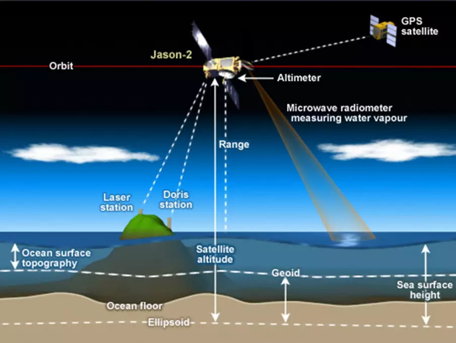
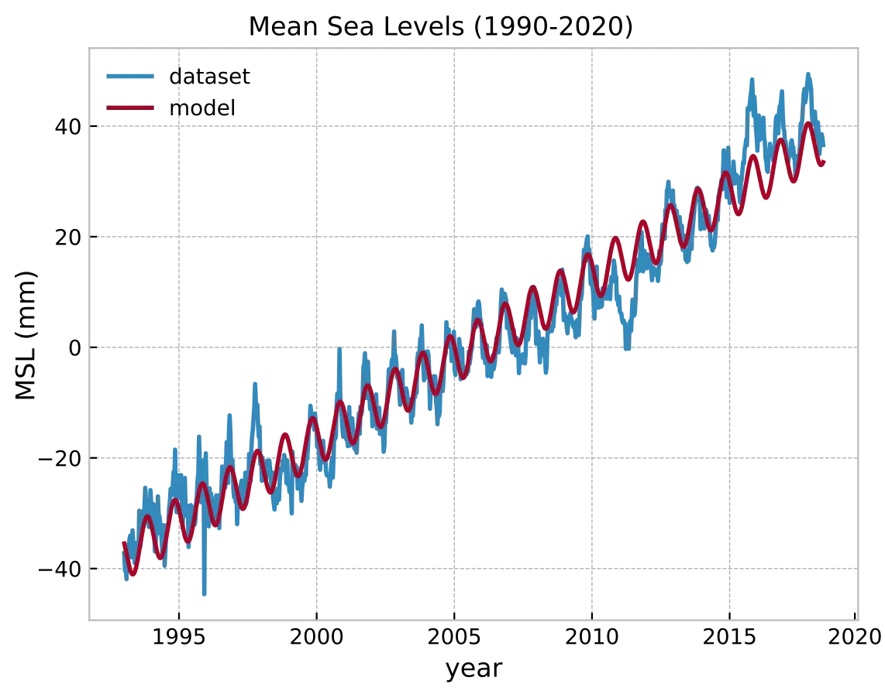

# Parameter Estimation

Satellite study taught us about parameter estimation, using a very apt problem statement of modelling sea level trends. Changes in sea/ground water levels can alter local gravitational fields of a region which, astonishingly, is enough to nudge satellite orbits by a minor extent. Such minute deviations from nominal orbits can inturn be used to estimate the local gravitational fields underneath and later also the sea level. The [GRACE](https://earthdata.nasa.gov/learn/sensing-our-planet/getting-at-groundwater-with-gravity) mission launched by NASA can say more. The measurements used in this page originate from the satellite altimetry [datasets](https://sealevel.nasa.gov/understanding-sea-level/key-indicators/global-mean-sea-level/) made by NASA and CNES's Poseidon and Jason missions. For achieving cm-level accuracy while making altimeter measurements, the satellite model was fused with laser and doppler measurements from the ground and GNSS signals from USA's GPS satellites in the orbits above Poseidon's. 

<div style="text-align:center"><br><em>Figure 1: A: Illustration of Jason-2 and B: Jason-2 before launch (source: NASA JPL)</em></div>

&nbsp;

The plot in blue in Fig. 2 shows mean sea levels (MSL) from the past few decades. A few parameters could be easily (linearly) estimated from this time-series signal.
- yearly increase
- when the MSL starts increasing in a given year

Assume the following representations:
- $y$: MSL
- $b$: bias/mean of the signal
- $m$: slope (yearly rise)
- $A$: amplitude of a periodic signal
- $\omega$: frequency of a periodic signal given by $\frac{2 \pi}{T}$
- $\phi$: phase of a periodic signal

The MSL if above parameters must be accommodated, can be modelled as:

$$
y = b + mt + Asin(\omega t + \phi) \\[3mm]
y = b + mt + A sin(\omega t) cos(\phi) + A cos(\omega t) sin(\phi) 
$$

To re-write the above equation as a parameter estimation problem,

$$y = 
\begin{bmatrix}
1 & t & sin(\omega t) & cos(\omega t) \end{bmatrix}
\begin{bmatrix}
b \\ m \\ A cos(\phi) \\  A sin(\phi)
\end{bmatrix} \\[3mm]
\underbrace{\begin{bmatrix}y_1 \\ y_2 \\ \vdots \\y_n \end{bmatrix}}_{Y} =
\underbrace{\begin{bmatrix}
1 & t_1 & sin(\omega t_1) & cos(\omega t_1) \\ 
1 & t_2 & sin(\omega t_2) & cos(\omega t_2) \\ 
& & \vdots\\
1 & t_n & sin(\omega t_n) & cos(\omega t_n) \\ 
\end{bmatrix}}_{H}
\underbrace{\begin{bmatrix}
b \\ m \\ A cos(\phi) \\  A sin(\phi)
\end{bmatrix}}_{X}
$$

where $\omega = 2 \pi$ since we are interested in the yearly period i.e. $T = 1$. $X$ can be estimated as:

$$
\hat{X} = (H^T H)^{-1} H^T Y
$$

solving (snippet in Appendix) yields 
$$X = [-5938.6 \quad 2.96 \quad -3.84 \quad 2.32]$$

- The yearly rise can then be given by $X_2 \approx +3$mm/yr. 
- The phase can be given by $\tan ^{-1}(\frac{X_4}{X_3}) \approx -1$. 
- Since sinusoid is flipped with an offset of 180° in figure 2, this marks the average start of the yearly sea-level rise to $-1 + 6$ i.e. May. This period marks the beginning of winter in the Antartic region and yet water fails to freeze 🤔?

The plot in red below shows the forward propagation of the model using the newly estimated parameters i.e. $\hat{y}$ = H$\hat{x}$.

<div style="text-align:center"><br><em>Figure 2: Sea levels measured v/s forward model</em></div>

&nbsp;

The above process goes by various names. Have heard finance call it fitting or linear regression. We have called it least squares fit or parameter estimation. What I took out of this lesson is that it yielded the optimal estimate $\hat{y}$ while nothing else could yield a lower error covariance (in $\mathrm{R}^2$ error sense). 

### Appendix: Story of the matrix inverse

There have been many ways to calculate an inverse of a matrix. Especially when a non-square matrix is around, pseudo-inverse or the Moore-Penrose is definitely coming to the picture. However, due to multiplication of a transpose above, i.e. $(H^TH)^{-1}$, we only have to worry about square matrices. 

Probably an overkill, but Singular Value Decomposition has been my favorite way to perform an inversion, because of multiple reasons.
- It gives the condition number right away from the first and the last entries in the $\Sigma$ matrix hinting the quality of the matrix inverse.
- Analogous results from `scipy`/`matlab` and [LAPACK](https://github.com/Reference-LAPACK/lapack) in `C` if SVD is explicitly stated as the method for inversion.
- SVD is used at multiple places, nice to be in touch with it. For e.g. during Principal Component Analysis using SVD, it is easy to discard a couple of rows/columns which correspond to tiny singular values.

After SVD, for a given matrix $A = U \Sigma V^T$, its inverse can be given by $A^{-1} = V \Sigma^{-1} U^T$  

Python snippet for the parameter estimation problem above:

```py
from scipy import linalg
import numpy as np

def lsq(h, y):
    # x = (H' * H)^{-1} * H' * y 
    hth = np.dot(np.transpose(h), h)    
    u, s, vh = linalg.svd(hth, full_matrices=False)
    hth_inv = np.dot(np.diag(1.0/s), np.transpose(u))
    hth_inv = np.dot(np.transpose(vh), hth_inv) # scipy gives out vh^T
    x = np.dot(np.dot(hth_inv, np.transpose(H)), y)
    # 360 deg = 12 months, offset of 6 months for phase inversion
    phase = np.round(np.rad2deg(math.atan(x[3] / x[2])) * 12.0 / 360.0 + 6)
    # estimated sea level (red plot)
    y_hat = np.dot(h, x)
    return y_hat
```

