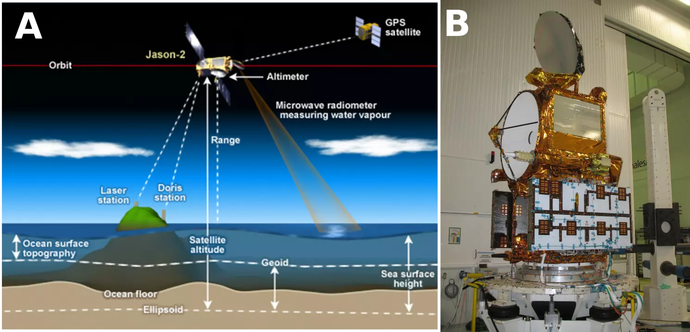
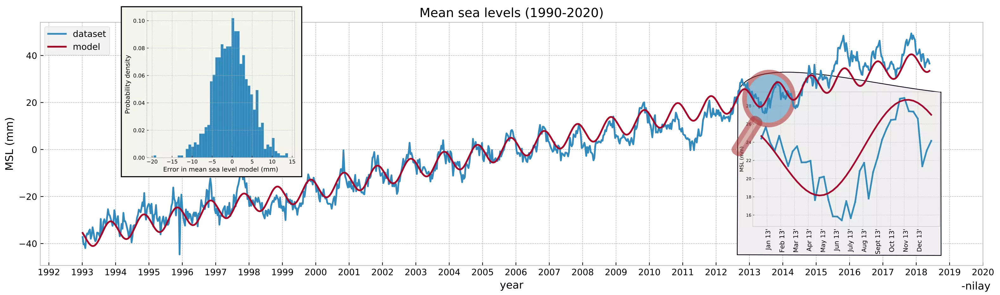

# Parameter Estimation

Satellite study taught us about parameter estimation, using a very apt problem statement of modelling sea level trends. Changes in sea/ground water levels can alter local gravitational fields of a region which, astonishingly, is enough to nudge satellite orbits by a minor extent. The [GRACE](https://earthdata.nasa.gov/learn/sensing-our-planet/getting-at-groundwater-with-gravity) mission launched by NASA can say more. 

The plot in blue shows mean sea levels (MSL) from the past few decades. Still maintaining the linear form, a few parameters could be easily estimated from this time-series signal.
- yearly increase
- when the MSL starts increasing in a given year

Assume the following representations:
- $y$: MSL
- $b$: bias/mean of the signal
- $m$: slope (yearly rise)
- $A$: amplitude of a periodic signal
- $\omega$: frequency of a periodic signal given by $\frac{2 \pi}{T}$
- $\phi$: phase of a periodic signal

The MSL if above parameters must be accommodated, can be modelled as:
$$
y = b + mt + Asin(\omega t + \phi) \\
y = b + mt + A cos(\phi) sin(\omega t) + A sin(\phi) cos(\omega t)
$$
The measurements/time-series data (vector `y` and `t` above) originate from the sea level [datasets](https://sealevel.nasa.gov/understanding-sea-level/key-indicators/global-mean-sea-level/) made by NASA's satellite altimetry missions Poseidon and Jason I, II, III (slightly different than the newer GRACE mission above).

<div style="text-align:center"><br><em>Figure 1: Jason-2 measuring sea levels cartoon (source: NASA JPL)</em></div>
</br>

To re-write the above equation as a parameter estimation problem,
$$y = 
\begin{bmatrix}
1 & t & sin(\omega t) & cos(\omega t) \end{bmatrix}
\begin{bmatrix}
b \\ m \\ A cos(\phi) \\  A sin(\phi)
\end{bmatrix} \\
\underbrace{\begin{bmatrix}y_1 \\ y_2 \\ \vdots \\y_n \end{bmatrix}}_{Y} =
\underbrace{\begin{bmatrix}
1 & t_1 & sin(\omega t_1) & cos(\omega t_1) \\ 
1 & t_2 & sin(\omega t_2) & cos(\omega t_2) \\ 
& & \vdots\\
1 & t_n & sin(\omega t_n) & cos(\omega t_n) \\ 
\end{bmatrix}}_{H}
\underbrace{\begin{bmatrix}
b \\ m \\ A cos(\phi) \\  A sin(\phi)
\end{bmatrix}}_{X}
$$
where $\omega = 2 \pi$ since we are interested in the yearly period i.e. $T = 1$. $X$ can be estimated as:

$$
\hat{X} = (H^T H)^{-1} H^T Y
$$

The yearly rise can then be given by $X_2 \approx +3$mm/yr and the phase can be given by $\tan ^{-1}(\frac{X_4}{X_3}) \approx -1$ marking the average start of the yearly sea-level rise to December. The plot in red below shows the forward propagation of the model using the newly estimated parameters i.e. $\hat{y}$ = H$\hat{x}$, while the plot in blue marks the raw values originating from the dataset. 

<div style="text-align:center"><br><em>Figure 2: Sea levels measured v/s forward model</em></div>

The above process goes by various names. Have heard finance call it fitting or linear regression. We have called it least squares fit or parameter estimation. What I took out of this lesson is that it yielded the optimal estimate $\hat{y}$ and nothing else can yield lower error covariance (in $r^2$ error sense). 

### Appendix: The story of matrix inverse

There have been many ways to calculate inverse of a matrix. Especially when a non-square matrix is around, pseudo-inverse or the Moore-Penrose is definitely coming to the picture. However, due to multiplication of a transpose above, i.e. $(H^TH)^{-1}$, we only have to worry about square matrices. 

Probably and overkill, but Singular Value Decomposition has been my favorite way to perform an inversion, because of multiple reasons.
- It gives the condition number right away from the first and the last entries in the $\Sigma$ matrix.
- More control/deterministic results w.r.t. `scipy`/`matlab` while using [LAPACK](https://github.com/Reference-LAPACK/lapack) in `C`.
- SVD has been a swiss-knife so it is nice to stay in touch with it. Like during Principal Component Analysis using SVD, it is easy to discard a couple of rows/columns which correspond to tiny singular values and maybe the solution still stays valid.

Python snippet for the parameter estimation problem above:

```py
from scipy import linalg
import numpy as np

def lsq(h, y):
    # x = (H' * H)^{-1} * H' * y 
    hth = np.dot(np.transpose(h), h)    
    u, s, vh = linalg.svd(hth, full_matrices=False)
    hth_inv = np.dot(np.diag(1.0/s), np.transpose(u))
    hth_inv = np.dot(np.transpose(vh), hth_inv)
    x = np.dot(np.dot(hth_inv, np.transpose(H)), y)
    # 360 deg = 12 months; phase deg = ? months
    phase = np.rad2deg(math.atan(x[3] / x[2])) * 12.0 / 360.0
    # estimated sea level (red plot)
    y_hat = np.dot(h, x)
    return y_hat
```

