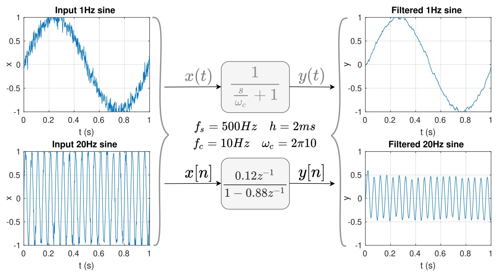
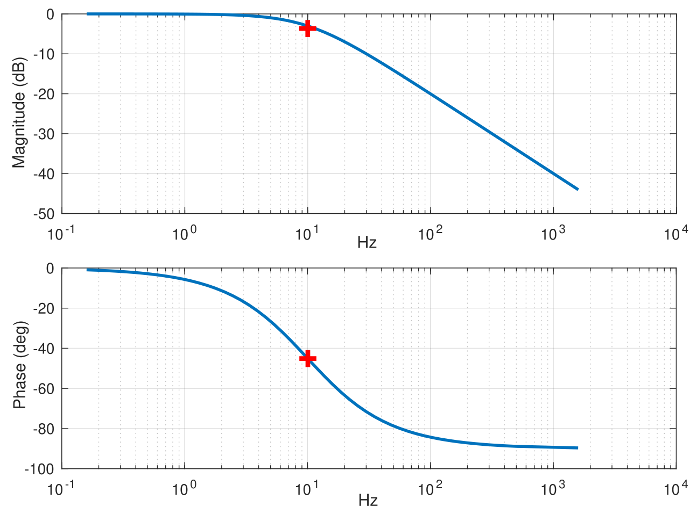
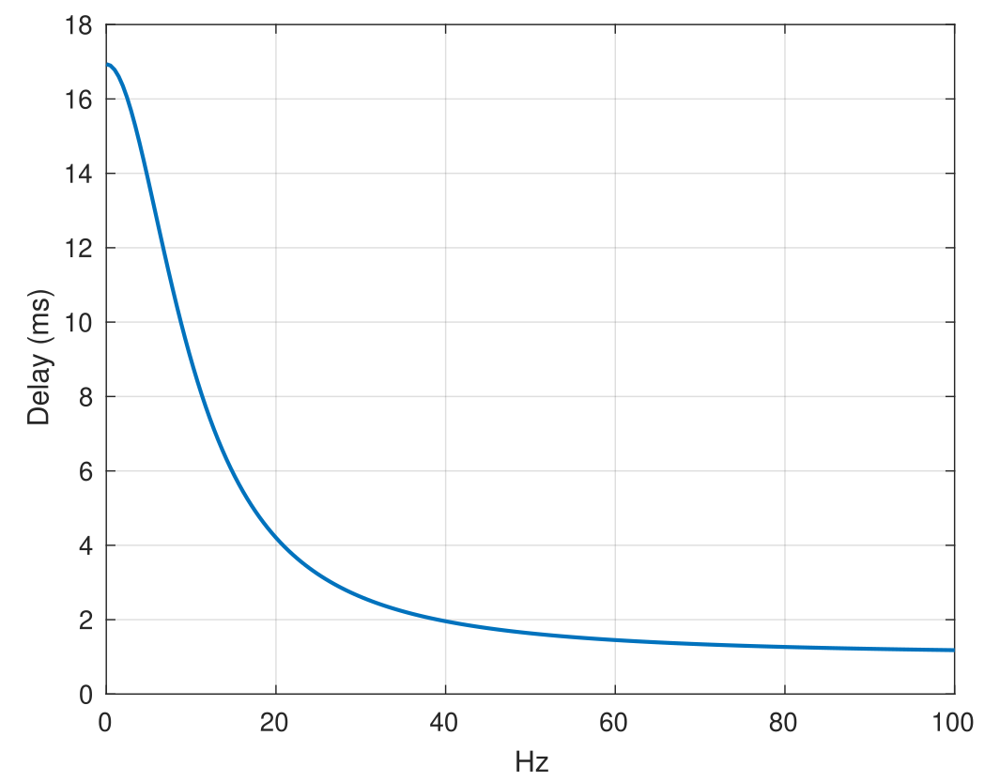

# Filtering
During my first year of undergrad, I came across a widely used filter on our robots called the complementary filter (correctly known as first order low pass filters). This filter was used to remove measurement noise from sensors before sending commands to actuators taking control actions.
Its implementation was just a one-liner in `C`:
```c 
out = alpha * in + (1 - alpha) * out;
```
I remember endlessly playing with `alpha` until it worked, where $\alpha \in (0,1)$. This page hints why and how this one-liner worked. tl;dr: This was infact a very simple IIR filter that we came across later during studies. *Disclaimer: There might be incorrect terminology in use while glueing embedded and control systems together.*

The first section shows the results one can expect from such a filter while the second section lists its design parameters. The third section discusses discretization, making it realizable on an embedded system. The fourth section lists a few of its expected characteristics and finally the fifth section gives the implementation of the filter in `C`. 

## Results
In the figure below, applying a filter $H(s)$ on a noisy input signal $x(t)$ can yield a cleaner $y(t)$. To realize this on the C-code of the robots, an additional step of discretization came into picture. Input "samples" $x[n]$ acquired by ADC/SPI/i2c of the μC could now be filtered using $H(z)$ giving out cleaner $y[n]$ signals. These cleaner output signals could then be used to send commands to the actuators.

<div style="text-align:center"><br><em>Figure 1: Filter action on noisy input signals</em></div>

## Filter design
The measurements from sensors were acquired every 2ms and sent out to the first-order low-pass infinite impulse response filter, while the cut-off frequency of 10Hz removes the random noise and attenuates all periodic signals above that frequency. The filters were usually applied to line-following sensors or IMUs, and being beginners in the field, we could get away with using 1<sup>st</sup> order IIR LPFs. This gave us the following parameters for design:
1. Type: Discretized 1<sup>st</sup> order infinite impulse response filter.
2. Sampling frequency $f_s = 500Hz$, Sampling time $h = 2ms$.
3. Cut-off frequency $f_c = 10Hz$, $w_c = 2 \pi f_c$.  

**Side notes**: 
- Such IIR filters are also called as the Exponential Moving Average (EMA) filters at times. 
- Nyquist urges $f_s$ of $500Hz$ to restrict the sampled signal to stay below $250Hz$, this is considered to be too lenient of a constraint. A rule of thumb might be restricting it to be 10 times slower, i.e. not higher than $50Hz$.

## But processors live in a discrete world 📈
In the Laplacian ℒ /continuous domain, the filter is given as:

$$H(s)= \frac{1}{(s/w_c + 1)} = \frac{1}{s/(20 \pi) + 1}$$

On discretization, $H(s)$ can be represented as $H(z)$ instead, which could later be implemented in the C-code of the robot. On substituting the design pparameters and using zero-order hold for discretization, $H(z)$ was given by:

$$H(z) = Z(H(s)) = \frac{Y(z)}{X(z)} = \frac{0.12}{z - 0.88}$$

In the z-domain, the filter can later be converted to a difference equation so to be able to realize it using just the "+" and "*" operators. Not completely sure if consistent with theory, but this could be how:

$$
\begin{align}
\frac{y[n]}{x[n]} &= \frac{0.12 z^{-1}}{1 - 0.88z^{-1}} \\
y[n] - 0.88z^{-1}y[n] &= 0.12z^{-1}x[n] \\
y[n] &= 0.12x[n-1]+0.88y[n-1]
\end{align}
$$

If we rollout one sample too early and replace the 0.12 term by $\alpha$, the filter could now be given as:

$$y[n+1] = \alpha x[n] + (1 - \alpha) y[n]$$ 

## Filter characteristics
With this implementation, $y[n]$ is guaranteed to remain bounded if $x[n]$ remains bounded and $\alpha \in (0,1)$, which translates to the requirement of the z-domain pole to lying inside the unit circle. Although not favorable, unexpected delays (latency/jitter) while sampling input $x[n]$ also keeps the filter bounded if the prior conditions are met.

<p style="text-align:center">



<br><em>Figure 3: Step response, Bode plot and Group delay</em>
</p>

- The rise time ($t_r$) of the filter is around 35ms and the settling time is around 63ms. Usually, $t_r \approx 2/w_c$.
- A bode plot of the continuous time filter shows the half-power (-3dB) gain and -45° phase lag as expected. Figure 1 already shows the gain to be halved after cut-off frequency. The phase delay for any periodic signal going through is also straightforward to calculate. A `bode` plot is nothing but values of `magnitude` and `phase` of the filter after substituting $s = j\omega$ in $H(s)$. i.e. For a signal of $1Hz$, 
$$H(s) = H(j\omega) = \frac{1}{1+0.1j} \approx 1 \angle -5.71^{\circ}$$
- The phase plot in the `bode` figure above hints that there is a phase lag of 5.71° for a periodic signal of $1Hz$. For such a signal, a delay of 1 second would mean 360° of phase shift. Hence for 5.71° of phase shift, there is a delay of $\approx 0.0158s$ from the input signal. 
- Group delay characteristics hint how much signals with different periodicities are delayed when they pass through this IIR filter. For a signal of $1Hz$, the plot below indicates around 8.4 samples of delay $\approx(8.4 * 2ms) \approx 0.0166s$, which is approximately the phase shift calculated above. If music signals were to pass through this filter, individual frequencies in the wide-band signal would be differently delayed, possibly distorting the music in an unfavorable manner. This highlights the primary shortcoming of IIR filters, i.e. its non-linear phase response. This shortcoming could then be resolved by using an FIR filter - which usually has a linear phase response and almost a constant time delay regardless of the frequency of input signals.

## C-implementation 💻
Implementing the first-order low-pass infinite impulse response filter in `C` was quite straightforward. Back then, we could get away without making header files or holding an instance of the states of the filter like the example below. The filter was used only at a single place and the states for us were just declared as `static` inside the function (which looking back wasn't smart or scale-able). The source below (`main.c`) has undefined platform-specific calls, which could be replaced for your case.
```c
/**
 * @file iir.h
 */

typedef struct {
    float out;
    float alpha;
} filter_lpf1_t;

float lpf1(filter_lpf1_t *filt, float in);
```

```c
/**
 * @file iir.c
 */

float lpf1(filter_lpf1_t *filt, float in)
{
    filt->out = filt->alpha * in + (1 - filt->alpha) * filt->out;
    return filt->out;
}
```

```c
/**
 * @file main.c
 */
#include "filters/iir.h"

/* 500Hz */
#define SENSING_RATE 2
/* 20 Hz */
#define ACTUATION_RATE 50

static filter_lpf1_t filt[2] = {0};

void init()
{
    filt[0].alpha = 0.12f; // fc: 10Hz, tr: 35ms
    filt[1].alpha = 0.5f;  // fc: 55Hz, tr: 6ms
}

void loop()
{
    float sensor_1_raw, sensor_1_filt;
    float sensor_2_raw, sensor_2_filt;
    uint64_t ms_count = get_millis();

    if ((ms_count % SENSING_RATE) == 0u) {
        sensor_1_raw = analog_read(A4);        
        sensor_2_raw = analog_read(A5);
        sensor_1_filt = lpf1(&filt[0], sensor_1_raw);
        sensor_2_filt = lpf1(&filt[1], sensor_2_raw);
    }

    if ((ms_count % ACTUATION_RATE) == 0u) {
        /* PID loops */
    }
}
```
A small let-down, been wanting to say that such filters can easily be realized **without** compute by directly using a simple RC network shown here. The cutoff frequency is decided by the components i.e. $R, C$ and is given as $f_c = 1/(2\pi R C)$, while the rise time $t_r \approx 2 RC$.

## Resources
- [Curio Res](https://www.youtube.com/watch?v=HJ-C4Incgpw)
- [Jason Sachs](https://www.embeddedrelated.com/showarticle/779.php)
- [Phil's lab](https://philsal.co.uk/)

Thanks to [Neel Nagda](https://github.com/neel-stark) for helping with fundamentals of the approach 🥳