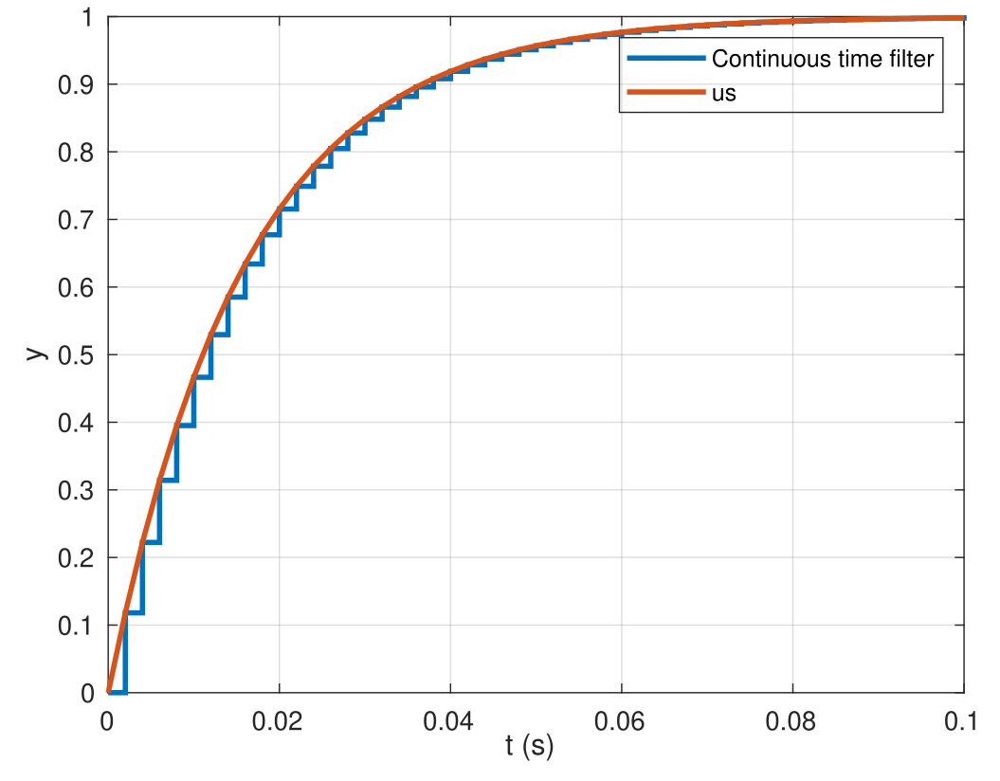
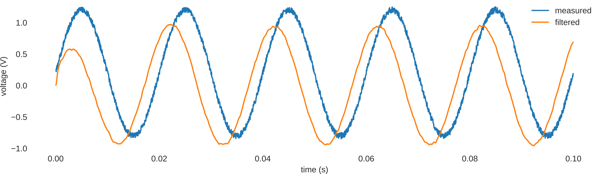

# Filtering
During my first year of undergrad, I came across a widely used filter on our robots called the complementary filter (correctly known as first-order low pass filters). This filter was used to remove measurement noise from sensors before sending commands to actuators taking control actions.
Its implementation was just a one-liner in `C`:
```c
out = alpha * in + (1 - alpha) * out;
```
I remember endlessly playing with `alpha` until it worked, where $\alpha \in (0,1)$. This page hints how this one-liner worked. tl;dr: This was in fact a very simple IIR filter that we came across later during studies. *Disclaimer: There might be incorrect terminology in use while gluing embedded and control systems together.*

## 1st order IIR filters

The first section shows the results one can expect from such a filter while the second section lists its design parameters. The third section discusses discretization, making it realizable on an embedded system. The fourth section lists a few of its expected characteristics and the fifth section gives the implementation of the filter in `C`.

### Results
In the figure below, applying a filter $H(s)$ on a noisy input signal $x(t)$ can yield a cleaner $y(t)$. To realize this on the C-code of the robots, an additional step of discretization came into the picture. Input "samples" $x[n]$ acquired by ADC/SPI/i2c of the μC could now be filtered using $H(z)$ giving out cleaner $y[n]$ signals. These cleaner output signals could then be used to send commands to the actuators.

<div style="text-align:center"><br><em>Figure 1: Filter action on noisy input signals</em></div>

### Filter design
The measurements from sensors were acquired every 2ms and sent out to the first-order low-pass infinite impulse response filter, while the cut-off frequency of 10Hz removes the random noise and attenuates all periodic signals above that frequency. The filters were usually applied to line-following sensors or IMUs, and being beginners in the field, we could get away with using 1<sup>st</sup> order IIR LPFs. This gave us the following parameters for design:
1. Type: Discretized 1<sup>st</sup> order infinite impulse response filter.
2. Sampling frequency $f_s = 500Hz$, Sampling time $h = 2ms$.
3. Cut-off frequency $f_c = 10Hz$, $w_c = 2 \pi f_c$.

**Side notes**:
- Such IIR filters are also called as the Exponential Moving Average (EMA) filters at times.
- Nyquist urges $f_s$ of $500Hz$ to restrict the sampled signal to stay below $250Hz$, this is considered to be too lenient of a constraint. A rule of thumb might be restricting it to be 10 times slower, i.e. not higher than $50Hz$.

### But processors live in a discrete world 📈
In the Laplacian ℒ /continuous domain, the filter is given as:

$$H(s)= \frac{1}{(s/w_c + 1)} = \frac{1}{s/(20 \pi) + 1}$$

On discretization, $H(s)$ can be represented as $H(z)$ instead, which could later be implemented in the C-code of the robot. On substituting the design pparameters and using zero-order hold for discretization, $H(z)$ was given by:

$$H(z) = Z(H(s)) = \frac{Y(z)}{X(z)} = \frac{0.12}{z - 0.88}$$

In the z-domain, the filter can later be converted to a difference equation so as to be able to realize it using just the "+" and "*" operators. Not completely sure if consistent with theory, but this could be how:

$$
\begin{align}
\frac{y[n]}{x[n]} &= \frac{0.12 z^{-1}}{1 - 0.88z^{-1}} \\[3mm]
y[n] - 0.88z^{-1}y[n] &= 0.12z^{-1}x[n] \\[3mm]
y[n] &= 0.12x[n-1]+0.88y[n-1]
\end{align}
$$

If we rollout one sample too early and replace the 0.12 term by $\alpha$, the filter could now be given as:

$$y[n+1] = \alpha x[n] + (1 - \alpha) y[n]$$

Assuming a zero-order-hold (ZOH) discretization, the calculation of $\alpha$ goes as ([ref](https://controlsystemsacademy.com/0020/0020.html)):

$$\alpha = 1 - e^{- 2 \pi f_c / f_s}$$

### Filter characteristics
With this implementation, $y[n]$ is guaranteed to remain bounded if $x[n]$ remains bounded and $\alpha \in (0,1)$, which translates to the requirement of the z-domain pole to lying inside the unit circle. Although not favorable, unexpected delays (latency/jitter) while sampling input $x[n]$ also keeps the filter bounded if the prior conditions are met.

<p style="text-align:center">



<br><em>Figure 3: Step response, Bode plot and Group delay</em>
</p>

- The rise time ($t_r$) of the filter is around 35ms and the settling time is around 63ms. Usually, $t_r \approx 2/w_c$.
- A bode plot of the continuous time filter shows the half-power (-3dB) gain and -45° phase lag as expected. Figure 1 already shows the gain to be halved after cut-off frequency. The phase delay for any periodic signal going through is also straightforward to calculate. A `bode` plot is nothing but values of `magnitude` and `phase` of the filter after substituting $s = j\omega$ in $H(s)$. i.e. For a signal of $1Hz$,
$$H(s) = H(j\omega) = \frac{1}{1+0.1j} \approx 1 \angle -5.71^{\circ}$$
- The phase plot in the `bode` figure above hints that there is a phase lag of 5.71° for a periodic signal of $1Hz$. For such a signal, a delay of 1 second would mean 360° of phase shift. Hence for 5.71° of phase shift, there is a delay of $\approx 0.0158s$ from the input signal.
- Group delay characteristics hint how much signals with different periodicities are delayed when they pass through this IIR filter. For a signal of $1Hz$, the plot below indicates around 8.4 samples of delay $\approx(8.4 * 2ms) \approx 0.0166s$, which is approximately the phase shift calculated above. If music signals were to pass through this filter, individual frequencies in the wide-band signal would be differently delayed, possibly unfavorably distorting the music. This highlights the primary shortcoming of IIR filters, i.e. its non-linear phase response. This shortcoming could then be resolved by using an FIR filter. At the expense of more computations, it offers a linear phase response and almost a constant time delay regardless of the frequency of input signals.

### C-implementation 💻
Implementing the first-order low-pass infinite impulse response filter in `C` was quite straightforward. Back then, we could get away without making header files or holding an instance of the states of the filter like the example below. The filter was used only at a single place and the states for us were just declared as `static` inside the function (which looking back wasn't smart or scale-able). The source below (`main.c`) has undefined platform-specific calls, which could be replaced for your case.

```c
/**
 * @file iir.h
 */

typedef struct {
    float out;
    float alpha;
} filter_lpf1_t;

void lpf1_init(filter_lpf1_t * filt, float fs, float fc);
float lpf1_run(filter_lpf1_t * filt, float in);
```

```c
/**
 * @file iir.c
 */

#include <math.h>

void lpf1_init(filter_lpf1_t * filt, float fc, float fs)
{
	filt->out = 0.0f;
	filt->alpha = 1.0f - expf(-2.0f * M_PI * fc / fs);
}

float lpf1_run(filter_lpf1_t * filt, float in)
{
    filt->out = filt->alpha * in + (1 - filt->alpha) * filt->out;
    return filt->out;
}
```

```c
/**
 * @file main.c
 */
#include "filters/iir.h"

/* 500 Hz, 2 ms */
#define SENSING_RATE 2.0f
/* 20 Hz, 50 ms */
#define ACTUATION_RATE 50.0f

static filter_lpf1_t filt[2] = {0};
static float sensor_1_filt, sensor_2_filt;

void init()
{
	lpf1_init(&filt[0], 10.0f, 1e3f / SENSING_RATE); // fc: 10 Hz, tr: 35 ms
	lpf1_init(&filt[1], 55.0f, 1e3f / SENSING_RATE); // fc: 55 Hz, tr: 6 ms
}

void loop()
{
    uint64_t ms_count = get_millis();

    /* Sensing loop */
    if ((ms_count % SENSING_RATE) == 0u) {
        sensor_1_filt = lpf1(&filt[0], analog_read(A4));
        sensor_2_filt = lpf1(&filt[1], analog_read(A5));
    }

    /* Control loop */
    if ((ms_count % ACTUATION_RATE) == 0u) {
    }
}
```

&nbsp;

A small let-down, been wanting to say that such filters can easily be realized **without** compute by directly using a simple RC network shown here. The cutoff frequency is decided by the components i.e. $R, C$ and is given as $f_c = 1/(2\pi R C)$, while the rise time $t_r \approx 2 RC$.

&nbsp;

## Butterworth filters
This is yet another type of IIR filter. The above first-order filter might be inadequate for they are only able to suppress the 20 Hz sine wave to half of its amplitude, even if it was outside the cutoff frequency of 10 Hz (ref. Fig. 1). In such cases, a second order Butterworth filter can be used for better suppression. They are known for their good roll-off rates and are also equally sensitive to all frequencies in the passband. They require a few more coefficients than just the `alpha` that I mentioned above. These coefficients might need to be borrowed from an online filter design tool since it is not straightforward to calculate them analytically.

### Results
The input is a sinewave and has around 10% uniform noise and a 20% DC offset augmented on top. This measurement is sampled at 20 kHz. There are two filters in use below (applied sequentially on the measurement). It consists of a low pass filter with a cutoff of 1 kHz followed by a high pass filter with a cutoff of 30 Hz.

<div style="text-align:center"><br><em>Figure 4: Low pass and high pass butterworth filters on a noisy sinewave</em></div>

It can be observed how the low pass filter removes the uniform noise and a smoother AC wave is observed. Also to note is how the high pass filter removes the DC offset present in the input signal. There is an overall phase lead in the output wave, predominantly because of the high pass filter's phase lead characteristics.

### C-implementation

```c
/**
 * @file butterworth.c
 */

struct bw2_filt {
	float b[3]; // bi, bi-1, bi-2
	float a[3]; // ai, ai-1, ai-2
	float y[3]; // yi, yi-1, yi-2
	float x[3]; // xi, xi-1, xi-2
};


/**
 * Initializes a second order butterworth filter based on filter co-efficients.
 *
 * Note: Filter can be of any type, high pass, low pass, band-pass or band-pass
 *
 * Ref: octave-online.net
 * [b, a] = butter(2, fc/(fs/2), 'low') with params where
 *  - 2 is the order.
 *  - fc is the cutoff freq.
 *  - fs is the sampling freq.
 *  - 'low/high' is the filter type
 *
 * @param f Pointer to the filter's data struct
 * @param coeff_b Co-efficients associated with the input signal
 * @param coeff_a Co-efficients associated with the output signal
*/
void bw2_filt_init(struct bw2_filt * f, const float coeff_b[3], const float coeff_a[3])
{
	f->b[2] = coeff_b[2];
	f->b[1] = coeff_b[1];
	f->b[0] = coeff_b[0];

	f->a[2] = coeff_a[2];
	f->a[1] = coeff_a[1];
	f->a[0] = coeff_a[0];

	f->y[2] = 0.0f;
	f->y[1] = 0.0f;
	f->y[0] = 0.0f;

	f->x[2] = 0.0f;
	f->x[1] = 0.0f;
	f->x[0] = 0.0f;
}


/**
 * Runs a 2nd order butterworth filter on the passed measurement
 *
 * A second order Butterworth filter can be expressed as:
 *
 *   (a[2] * y[2] + a[1] * y[1] + a[0] * y[0])
 * = (b[2] * x[2] + b[1] * x[1] + b[0] * x[0])
 *
 * @param f  Pointer to filter's struct
 * @param in Input signal
 * @return Output signal
 */
float bw2_filt_run(struct bw2_filt * f, float in)
{
	// shift history by one
	f->x[0] = f->x[1];
	f->x[1] = f->x[2];
	f->x[2] = in;

	f->y[0] = f->y[1];
	f->y[1] = f->y[2];

	// run the filter
	f->y[2] = (1.0f/f->a[2]) * ((f->b[2] * f->x[2] +
								 f->b[1] * f->x[1] +
								 f->b[0] * f->x[0]) -
								(f->a[1] * f->y[1] +
								 f->a[0] * f->y[0]));

	return f->y[2];
}
```

```c
/**
 * @file main.c
 */
void main()
{
	// load params
	float fs = 20e3f; // sampling freq: 20 kHz
	float t = 0.0f;   // elapsed time (s)

	// open files for logging
	FILE * filt_fp, * est_fp;
	filt_fp = fopen("filt.csv", "w+");

	// initialize a low pass filter via [b, a] = butter(2, 1000/(20000/2), 'low');
	// Note: accuracy matters, use precise co-efficients
	struct bw2_filt lpf_1kHz;
	const float lpf_1kHz_coeff_b[3] = {0.020083365564211f,  0.040166731128422f, 0.020083365564211f};
	const float lpf_1kHz_coeff_a[3] = {0.641351538057563f, -1.561018075800718f, 1.000000000000000f};
	bw2_filt_init(&lpf_1kHz, lpf_1kHz_coeff_b, lpf_1kHz_coeff_a);

	// initialize a high pass filter via [b, a] = butter(2, 30/(20000/2), 'high');
	// Note: accuracy matters, use precise co-efficients
	struct bw2_filt hpf_30Hz;
	const float hpf_30Hz_coeff_b[3] = {0.993357832710430f, -1.986715665420860f, 0.993357832710430f};
	const float hpf_30Hz_coeff_a[3] = {0.986759784293781f, -1.986671546547938f, 1.000000000000000f};
	bw2_filt_init(&hpf_30Hz, hpf_30Hz_coeff_b, hpf_30Hz_coeff_a);

	while (1) {

		// step ahead in time
		t += 1.0f/fs;

		if (t > 0.1f) {
			// flush all filestream buffers before stopping
			fflush(filt_fp);
			break;
		}

		// emulate a sinewave measurement
		float volt_meas = gen_50hz_sinewave(t);

		// first LPF
		float filt_volt_meas = bw2_filt_run(&lpf_1kHz, volt_meas);
		// then HPF
		filt_volt_meas = bw2_filt_run(&hpf_30Hz, filt_volt_meas);
	}

	fclose(filt_fp);
}
```


## Resources
- [Curio Res](https://www.youtube.com/watch?v=HJ-C4Incgpw)
- [Jason Sachs](https://www.embeddedrelated.com/showarticle/779.php)
- [Phil's lab](https://philsal.co.uk/)

Thanks to [Neel Nagda](https://www.linkedin.com/in/neelnagda/) and [Laurence Willemet](https://www.linkedin.com/in/laurence-willemet-679a1310a/) for helping with the implementation of this approach 🥳.
