# Learnings
This page shares a few lessons that I learnt while working on robots. The stories contain robotics jargon, but I believe that at the core, the lessons I learnt stem from us humans just being humans.

## Lesson 1: Characterizing failure modes
I learnt that taking the time to characterize the existing failure modes among critical components and drafting a safe counter-strategy is a great way to use time. Only by having this layer figured out, should a team focus on building more on top.

### Catching joystick failures
During my undergrad back in 2013, we used PlayStation 2 joysticks (Fig. 1) as input devices for controlling our robots. Multiple buttons and axes on the PS2 joystick were mapped to several actuators on the robots (including key combinations!). E.g., each hat of the joystick had two axes, `x` and `y`. We mapped our robot's driving motors to these axes, so the robot could navigate around the arena just like a car in a video game. The more off-center the joystick was, the faster the robot traveled on the arena.

<div style="text-align:center">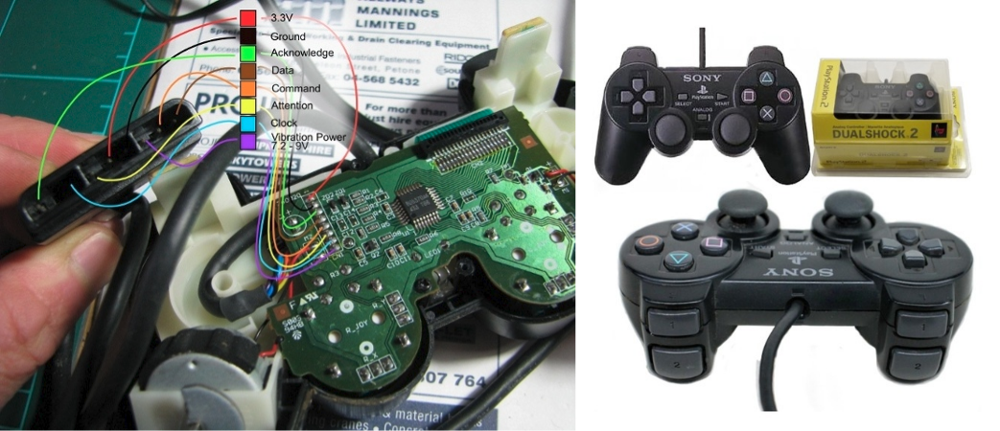<br><em>Fig. 1: Left: Pinouts from the joystick, Right: Sony PS2 joystick (source: Tech monkey business)</em></div>

Surprisingly, after doing so, we often found our robot going haywire across the arena as if it had received an incorrect signal. Being pressed for time, we chose to accept this anomaly and kept building more functionality on top. Eventually during one of the practice runs, the robot had a serious crash, damaging our heavy-duty actuators, pneumatics and wiring harness. This incident increased our anxiety for the upcoming matches staged against hundreds of universities around India. Consequently, the software team found the saturation of joystick signals (saturated to `0xFF` when incorrect) as the issue behind this. This would happen when misaligned bytes from received joystick data were unpacked. They patched the issue by adding a simple conditional.

```c
while (!(((left_hat.x == 0xFF) && ((left_hat.y == 0xFF))) ||
         ((right_hat.x == 0xFF) && (right_hat.y == 0xFF)))) {
    // Execute robot control code only if signals are not saturated
}
```

With this, we could skip sending incorrect setpoints to the motors when the joystick sent incorrect/saturated values to the microcontroller. Then onwards, the robot just paused (very briefly) on the arena when such an anomaly occurred. Would this have been carefully looked at instead of rushing to build more on top, we could have avoided the anticipation of this problem which could occur at anytime. We could have used this mental space for something more productive. Because of many such anomalies, the limited practice time was subsumed by repeating runs and hoping for miracles, rather than building a robust foundation.


### Brown out/thermal shutdown of linear regulators
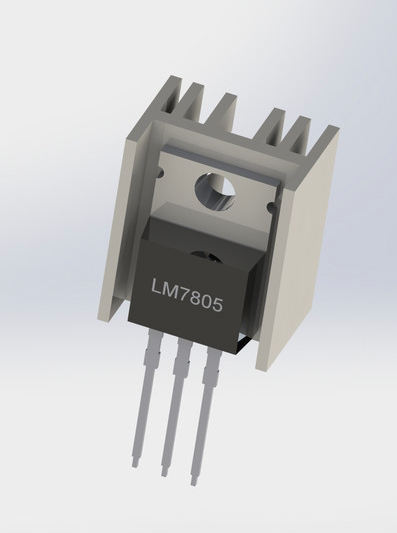

In another instance, we found out about the internal protection mechanisms of voltage regulators by accident. We had various voltage regulators placed across the robots, powering various onboard sensors and switches. We often found them in our discard pile everyday, and one of us thought of giving the discarded regulators a chance. On retesting them, we were surprised to see that each one worked perfectly. It was almost funny that in days of tight budgets, someone was throwing them out?! Eventually, we found out that while prototyping, there were chances of excess current draws which would instantly overheat the LDOs. The regulators could heat up to as high as 120 °C before entering a thermal shutdown state. There might have been some hysteresis on this, keeping the ICs non-functional until they cooled down near room temperature. By then, the students would have identified this regulator as a cause of failure and blatantly replaced it with a newer regulator. Had we spent time reading the datasheets of this obvious component - especially the section on thermal shutdowns, we could have prevented discarding perfectly functional components.

### Blowing sensors
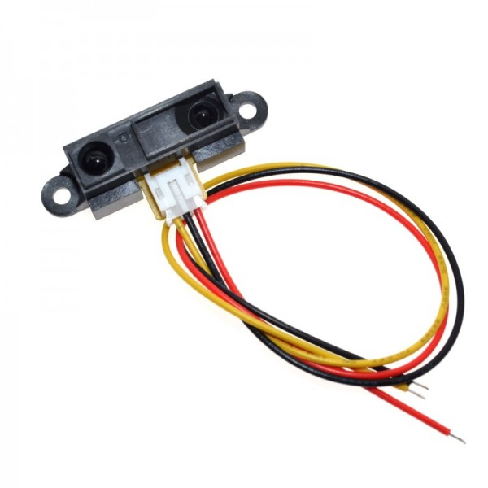

Another instance where taking time to characterize the components would have saved time and money was while using one of the infrared distance sensors on our robots. To detect abrupt disconnections from sensors, we pulled up analog channels of the µC to diagnose failures. When there would be a disconnection, the µC would instead read a pulled-up/saturated value instead of a voltage within a sensor's measurement range. The saturated reading would then be rejected in our pipeline and the robot could avoid taking wrong decisions based on incorrect values.
In case of the infrared sensor in this picture, only after blowing up 4 sensors, we realized that there was no reverse current protection on the signal pin of the sensor. Pulling up the pin from the µC side meant that when the sensor measured a low voltage, a small current would travel from the µC to through the sensor's signal pin, probably enough to damage it. In this case, pulling up a pin for sensor diagnostics wasn't a good idea and it instead ended up damaging the sensors. A careful read of its datasheet/whitepaper would have saved time and money.

### Blowing motor drivers

Another instance when knowing the root cause of a problem helped us make good design decisions, was during the selection of motor controllers. After burning through a couple of motor controllers during practice runs (Fig. 2), we learnt more about motors, motor drivers and battery sizing. During our practice runs, when the robots used to hit the arena boundaries, or in general when motors hit end stops, they stalled momentarily. During the stall (even if instantaneous) they drew excess current from the battery via the motor drivers. The expensive Hercules/VNHS motor drivers (₹ 2500 each) then instantly burned through, letting out a dangerous spark.

<div style="text-align:center">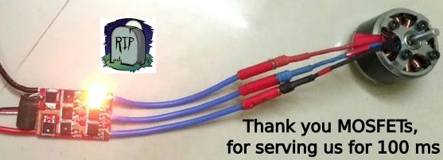<br><em>Fig. 2: Drawing excess current through motor drivers (source: TheCuriousOne)</em></div>

While using lithium polymer batteries for powering our robots,  whenever the load requested a high current, the motor drivers burnt through their MOSFETs at the mercy of their poor internal protection mechanisms. We had skipped reading from the current sensing pin of the motor drivers which usually helps keep power delivery in check. We could have just reduced the duty if we measured a high current via the motor driver. But we faced the familiar struggle of embedded systems - shortage of pins on the µCs. There were no configurable ports for "just diagnostics".

We now decided to stick to the infamous, cheap, heavy and low current 12V lead acid batteries. They also hilariously served as a counterweight for the structure of the robot. After switching to lead acids, even if the motors stalled, the motor drivers only drew as much current as the lead acid sourced, far less than the rated amperage of the motor drivers - saving us from expensive burn-downs. Eventually, we transitioned from 12V to 24V supplies for motors, which helped in fewer heating problems and a lower current could be sourced for the same power. The harness got easier, the wire gauge could be smaller.

### Software architecture

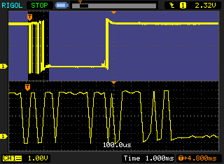

Another story with the software team now! Back in 2013, we moved away from bare metal firmware and started writing our own library/abstraction layers for AtMegas, which enabled us to call functions instead of cryptically writing into registers. To our surprise, our toolchain and embedded board did quite a lot - built firmware without extensive setups and flashed hex files from CLI onto an accessible in-serial-programming port. We could read out from ADCs with apt resolutions and sampling rates, connect PlayStation joysticks, write to 16x2 LCDs, control a lot of motors and pneumatic solenoids and interface with I<sup>2</sup>C/SPI peripherals. But the architecture and the approach lacked robustness. We called our library `sra.c` and had another `main.c` with all the control code. It ran a single CPU task, with everything inside a `while(1)` and without any delay. CPU utilization? A 100%!

To add to that, we lacked the vision to provide debouncing to our limit switches, smooth out our sensor measurements and most importantly use any instantiable data structures for each hardware component. The illustrated oscilloscope plot shows what a button press can look like. If the microcontroller sampled quick enough, a single toggle could look like several toggles. This is due to the mechanical properties of the return spring and how these switches work internally in general.

<div class="learn">
<iframe src="https://www.youtube.com/embed/XozfTtQIZjU"
        frameborder="0"
        allow="accelerometer; autoplay; clipboard-write; encrypted-media; gyroscope; picture-in-picture"
        style="padding: 10px"
        allowfullscreen>
</iframe>
<iframe src="https://www.youtube.com/embed/X-0vHquG6vE"
        frameborder="0"
        allow="accelerometer; autoplay; clipboard-write; encrypted-media; gyroscope; picture-in-picture"
        style="padding: 10px"
        allowfullscreen>
</iframe>
</div>

In the video to the left above, the entire state machine of the control code was based on reading **un**debounced switches, resulting in the robot falling off the poles because of registering too many clicks and thinking it finished the task. In the video to the right, we prototyped another robot doing the same task of traversing the poles with a bunch of servo motors and electromagnets.

### Noise

Another common failure mode was measuring a significant amount of noise on the measurements while sampling from sensors. This could be extra noise on distance measured by infrared sensors or even disruptions on i2c communication lines. The graph alongside isn't ours (credits: arduino blog), but a representation of how PWM noise/EMI could affect sensor measurements.

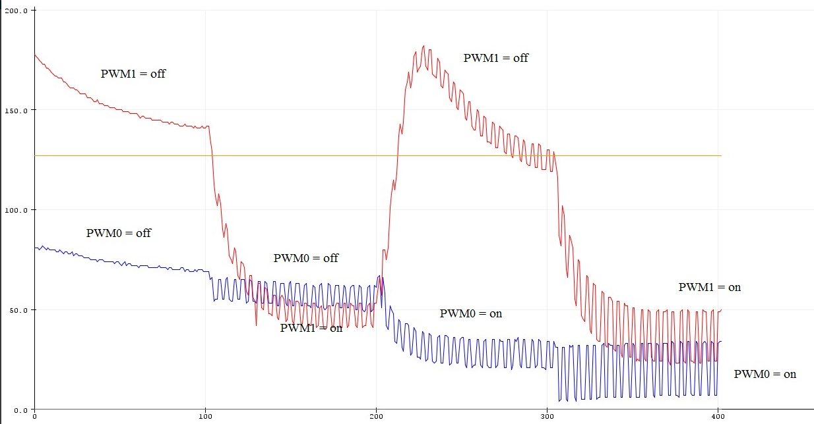

To peek into this issue, we were able to borrow an oscilloscope from our university lab (after a lot of paperwork). On connecting it to the sensor's pins, we were surprised to see a superimposed waveform on top of the sensor's analog signal. We could quickly identify the waveform to have the same frequency as the PWM switching frequency of our motors. Another way to diagnose EMI was a lot of missed packets on the i2c bus when motors/EMI sources turned on. To resolve this, we separated the power & ground rails for sensors and actuators and added more 10uF decoupling electrolytic capacitances on the separated power rails. Another solution included adding a 100nF (104) ceramic cap across the motor to suppress noise. Would we have learnt to probe our PCBs earlier, we'd have been able to diagnose the noise, learn filtering techniques and build better control algorithms on top. I think we still haven't completely gotten rid of these issues and would love to get your input on these (email me).

### Failure in approach

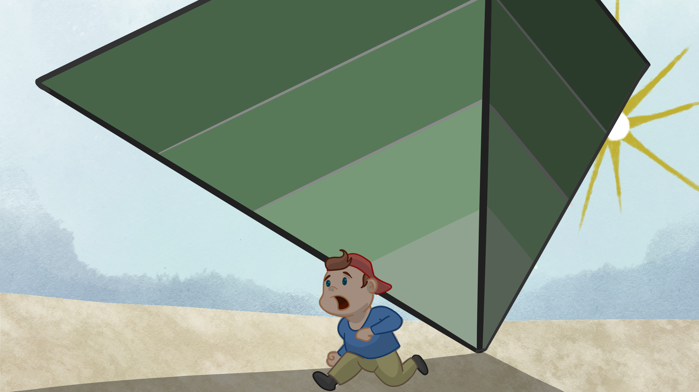

The part that was common in all the above anecdotes, was that we kept retrying practice runs without solving the root cause of failures. The worst part about retrying was that when the bytes (and stars) aligned for us and sensor noise didn't affect control decisions, our runs worked out perfectly. A good practice run would deceivingly provide enough reinforcement to let our underlying failures linger. We had little clue that we were breeding failure as we built more on top everyday. Our response to failures was often to "try the run again", patch the symptoms and not spend time diagnosing the root cause. We hadn't developed good first-principles thinking, curiosity or patience to deal with such root issues. Our mentorship and experimentation tools for self-debugging were still preliminary. Newly popping issues were mentally noted and if they qualified as minor hindrances, they were not taken seriously. In international league matches, where the reputation of the robotics efforts of our country was on our shoulders, confidence in ourselves and on the robot was key for putting up the best performance. Such unaddressed and lingering issues had seeped into the confidence of the team. We performed alright at the arena, but were pretty stressed and on our toes all the time in anticipation of failures.

A failure, in my opinion, can be characterized ~~early~~ on time, by assessing its consequences using the butterfly effect. Missing a reading from a switch/button can lead to a broken actuator, increase repetitive work for the mechanical team, trigger a fiasco in the software team and seep into the faith of everyone. "The thing about being wrong is, you never know how you are wrong" - Dr. Burry, The Big Short. My suggestion is to label an attempt as a failure rather early, adopt first-principles thinking and seek mentorship.

To confess, it was not all that gloomy - we shared laughs, responsibility for failures and stayed modest as we grew up as engineers in the team. We reached the finals in the national competitions going up against 200 universities and in the top leagues in the internationals by planning very simple strategies and navigating around our shortcomings to face the defending champions.

<div class="learn">
<iframe src="https://www.youtube.com/embed/e_E5RlIjP10?si=KGV0K5WJJJlYgGax"
        frameborder="0"
        allow="accelerometer; autoplay; clipboard-write; encrypted-media; gyroscope; picture-in-picture"
        style="padding: 10px"
        allowfullscreen>
</iframe>
<iframe src="https://www.youtube.com/embed/GSJcOd8I6PU?si=pFQKN28HD5luKp1z"
        frameborder="0"
        allow="accelerometer; autoplay; clipboard-write; encrypted-media; gyroscope; picture-in-picture"
        style="padding: 10px"
        allowfullscreen>
</iframe>
</div>

The two amazing robots we witnessed that year were: Nirma Robocon (left above) and Lac Hong Vietnam (right above).

## Lesson 2: Modeling and metric units

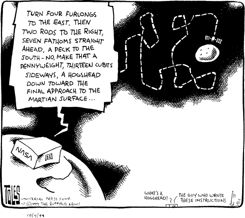
A simple mathematical model that uses metric units is crucial for communicating goals and ideas in systems engineering. These mathematical models do not have to be too sophisticated but can stay rather rudimentary. A goal could be as simple as moving 2 meters within 5 seconds or so. Such goals tend to harmonize the mechanical, electrical and software teams towards a tangible goal to optimize. For mechanical, they might realize that increasing wheel RPMs is not the best way to go faster, because of the torque limitations of the motor. Or that they might need to explore a [swerve drive](https://youtu.be/rNPtfMkFb7c). For electrical, it might mean using a motor controller that can accept deceleration by creating a short across the motor to decelerate the robot. Doing so would essentially pull the back EMF instantly to zero, and consequently oppose the cause of back EMF, i.e. free spinning of the wheel. Or maybe they need to improve the estimates of [motor encoders](https://curiores.com/positioncontrol) or install 1D SICK-laser rangers on the frame. For the software team, it could mean pushing the robots to follow motion primitives like velocity profiles and feedforward motor RPMs. The solution in the minds of each team differs significantly, however, aimed at the same goal. Using a metric unit can exactly assist with that - uniting everyone.

At SRA, we stored various thresholds for distance sensors, wheel RPMs and many such entities as a fictitious `const` defined somewhere in the files. Nothing was scaled/fused to metric units inside the software. I could see the benefits of doing so years later at [AlphaPilot 2019](https://nilay994.github.io/projects). Tangible physical quantities gave me a knack for what we expected the robot to do.

During AlphaPilot, we had our very first flight scheduled at MIT's AeroAstro lab. Before taking the drone inside, I strode across the arena to almost cover a meter with every footstep. Only while running across the arena did I realize that the drone had only around 300 ms to react toward the first target, or it was too late. Without turning on the propellors, I recorded realistic datasets with the drone's onboard camera with blur and bank angles of more than 45 degrees emulating a vibrating frame during agile flights. Federico later told me that my frantic running looked hilarious from the acoustically separated viewing box of the lab. But I can assure you that this running around helped to realize a lot of control objectives. During our flight debriefings, the language often in use was "The current solution decreased mean velocity by *0.5 m/s* or that we reported a roll velocity of around *300 deg/s*, which caused the blur on the images". These numbers painted a picture for everyone of what we strove towards.

<div style="text-align:center">
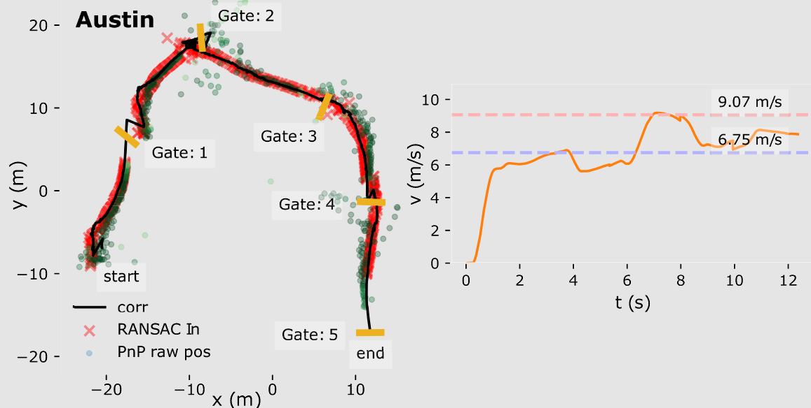
<br><em>Our flight logs at Austin. Left: Top view of the positional estimates in meters, Right: Drone velocity in m/s</em>
</div>

&nbsp;
&nbsp;

## Lesson 3: A strong baseline/platform to start from

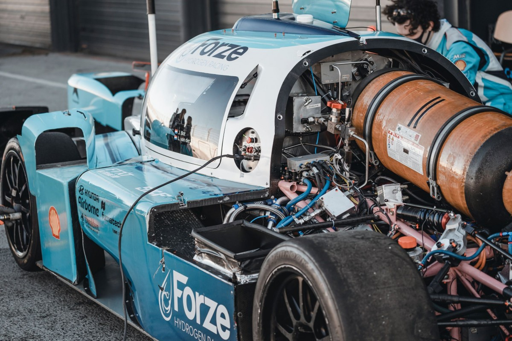
*Tell me and I forget, involve me and I learn - Xun Kuang*. But our version was: "Tell me and I forget, show me how and I do it better than you". When our seniors first participated at Robocon, the software team programmed in assembly while the mechanical team built the chassis with wood. By the time we participated, we had a microcontroller abstraction library, AtMega 1280s (two separate controllers, connected via SPI to increase pinouts), and aluminium chassis with rivets for quickly prototyping our robots. This gradually transitioned towards the famous STM32s, PlayStation joysticks and brazed aluminium (ensuring 4 point contact for our omniwheels). Each of these improvements required us to venture out and religiously observe others who were doing better than us - forcing us to factor in these improvements. A new batch of students likely feel the urge to reinvent the wheel when platforms are unreliable. Offering a reliable and scalable platform to future batches should hence be one of the core responsibilities of a student team. Each year, a team needs to build on top of the previous and pass on the learnings as an abstracted platform to the next year. "The worries of today should be abstracted out tomorrow, for tomorrow is for building on top of today" - me.

A good example of each year building on top of the other is the Forze IX project: the fastest hydrogen race car in the world, built over 3 long years (picture credits: Forze Hydrogen Racing, Delft). Fuel cell technology is incredibly complicated and yet a student team not only built it but raced with it against gasoline cars. They've had strong industrial sponsorships and senior mentorships - key to where they are now.

## Lesson 4: A constant (assured) revenue stream

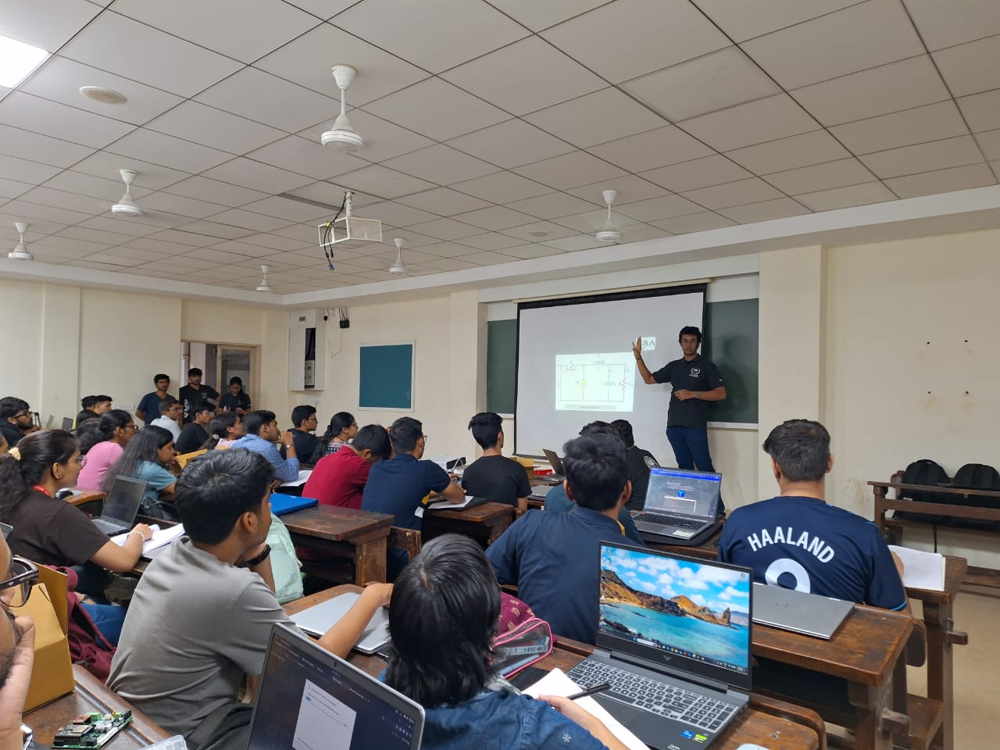

The senates of the robotics chapter were responsible for propagating the knowledge they gathered under the mentorship of the batches before them. Most years also saw revolutionary projects that changed the narrative of robotics at the university for years to come. Talking about our seniors, the batch of 2014 and 2015 - they found a way to secure a constant revenue stream for the society. In days when the society's bank accounts ran dry, with no sponsorship or institutional support, this constant revenue stream meant everything to us. The idea was a workshop-based revenue model: Teach robotics, sell robotics kits and earn money. It was simple, more robotics workshops = more funds. After winning at Robocon in the national leagues we were in urgent need of funds to build competent robots for the international leagues. Batch of 2014 quickly started a new company under which a 1-week robotics workshop could be given to around 300 students in and around the city. Fees were still kept mindful to allow everyone to have access to such fun robot-building knowledge. And the efforts pulled off, the marginal profits from the workshops were enough to source components for our new robots from all over the world! That batch's entrepreneurial ability at such a young age was contagious. We continued it for the years to come and improvised upon it. With batch manufacturing, inventory management,  beginner-friendly PCB designs and fun slides to keep workshops interesting after lunch - we've been better each year.

## General learnings

A few general lessons that I could pick from this experience were:
- Planning is essential. When goals get stressful, it is important to plan more in the short term. Summarizing today and planning tomorrow. Taking it by the day. Long-term visions can be held, but short-term goals are the only ways to achieve them.
- Finding ways to challenge everyday by searching outside the bubble of the mundane. Getting mentorship. Breaking the unguided inertia.
- Questioning the solution and striving to find answers everyday. Evaluating and failing fast. Having the guts to restart from scratch.
- Reducing the unknowns while reaching closer to the target. Thinking in first-principles - if physics says it is possible, strive to build it.
- The "chalta hai" (it'll be fine) and "ho jayega" (will work out eventually) attitude had to be thrown away. Indifference to inefficiency should not linger around too long.


# Team
We loved to come to the lab everyday, make small progress or even **un**progress everyday, most often seeing our ideas not working out and some days being utterly surprised by what we made together. We strove to include all disciplines of engineering and also all genders. The latter being more challenging to achieve for various reasons. Fortunately, the team in recent years has been brilliantly diverse! Our team consisted of not only the members that are listed below but also our seniors and juniors without whom our ambitious projects could not take shape. However, we did wish we had a bigger and more diverse team, for we could have delegated more, built better and had more fun together.

## Udit Patadia

<p>An introduction to SRA's 2016 batch should start with Udit Patadia. In his early years, he led the mechanical team of SRA. It was magical how quickly he came up with a design, cut and rivet aluminium pieces together with the utmost quality. His directness was astonishing - leaving no room for ambiguities to exist in the quality of execution. Pleasing others often came dead last in his priorities since it was usually about surprising himself with his own efforts toward any task. His passion persisted regardless of external validation. In our international leagues of Robocon 2014, while the stadium was filled with cheers from more than 10000 people, he was one with the robot. He didn't feel any tremble and his movements stayed graceful, as he steered the robot to one of the best performances the robotics chapter of VJTI has ever put up. After this stint, he took on building a huge CNC machine for prototyping future robots. Shortly after, he found his love for software in the newly released ROS beta in his newly installed Ubuntu partition. His contributions to the lab continued even after his graduation in 2016 and his philosophies are distinctly visible when we read SRA’s annual newsletters. No matter where he is now, I remember that he once took an entire exam in analog electronics where his calculator was stuck in the less-known "gradient" mode, giving him entirely different numbers than what we filled in as degrees.</p>

## Rahul Solanki

<p>The lead for software. I remember meeting him first when he surprised seniors by memorizing the datasheet for the AtMega32 processors we had in the lab. He was the first one amongst us to join SRA and quickly started exploring the libraries for our embedded systems. His ability to keep his calm in a crisis and churn out hex firmware from the newly patched C code was beyond impressive. He could spot multiple anomalies inside the code from a single trial run. He knew which subroutines to alter and committed to it even when our practice slot would be due in the next 15 minutes. He built a pulse oximeter during his internship at MIT-REDx and mentored several junior teams on the side. Being displeased with the challenge offered by amateur microcontrollers we used on our robots, he learnt Java and Matlab within a week. He built Android applications and inconsequentially found various ways to segment the foreground from images using computer vision. Difficult to forget his "can be motivated today, can learn tomorrow, can execute day after" attitude coupled with humour - reflecting his light take on life while being one of the smartest in the room. He spent sleepless nights with us at the lab, and while we would struggle with exams the next day, Rahul would somehow always find himself in the top 5 percentile of the class. He now works on facilitating AI technologies at the biggest companies in Silicon Valley. No matter where he is now, I remember that he never agreed to edit his code for swapping a few pins in the microcontroller’s code when there was a mixup, leaving us to fix all the connections in the robot's wiring harness.</p>

## Kewal Shah
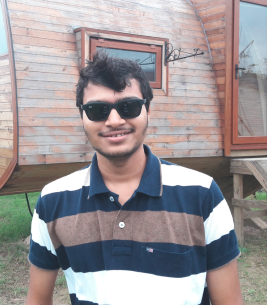
<p>Our electronics lead - the most proficient in embedded firmware amongst us. He handled one of the most crucial operations of the society - the workshops. After he designed the PCBs for the workshops that would teach robotics to 400+ students of Mumbai that year, he would juggle with quotations from electronics suppliers, project profits from the workshop and estimate if they'd be enough to pursue the year's ambitions. Be it analog design or revenues for the year - he went all flash with the calculations with the num-locked part of the keyboard. Several projects followed for him, like the wrist-watch multimeter and swarm robots on LiFi. During our international leagues, he could briefly bend over and spy on our opponent’s robots to identify a plethora of sensors and microcontrollers which would be crucial for our next robot designs. You could know if Kewal was frustrated when you hear eloquently articulated swear words, providing both clarity and motivation in a single sentence about what had to be done further. The eloquence of the crafted sentence was directly proportional to how "off" you were from what was expected. After blowing up a variety of components in the practice arena, Kewal often received a list of components to buy the next day when the electronics market opened in Grant Road, Mumbai. This often implied missing the first lecture of the day. We can almost establish a relation between a drop in his test scores and that course falling early on our timetable. Right after his bachelor's, he moved to the semiconductor heaven, China. Working in Shanghai, he now sponsors the most significant part of the robot - the central microcontroller. This is key to SRA's workshops, knowledge transfers and embedded proficiency. It is one of the most advanced microcontrollers there is in that form factor in the world. No matter where he is now, I remember him being very positive about political reforms in the country until he was asked for a bribe by the customs for unfreezing our imports.</p>

## Dhiraj Patil

<p>Also our electronics lead and the most hardworking amongst us all. He commuted 3 hours everyday, (including weekends) in the notoriously overcrowded local trains of Mumbai to sharpen his proficiency in analog electronics and robotics. He was, yet, the first one to arrive and the last one to leave. I remember a day when he was posed with an excessively complicated power supply design problem. He had a week to finalize the schematics and manufacture a PCB for a 7V 20A power supply for one of the robots of Robocon 2014. He came up with a complicated yet functional design that worked exactly as expected (though we added a few cooling fans to keep his transistors safe). He used to also on the side run an apprenticeship for installing CCTV systems around the city. As he grew more confident in his proficiency, he quickly wanted to bring it to use in society. He started providing electric wheelchairs with electro oculography-based inputs for quadriplegic patients which also caught the attention of local newspapers. After his study, he went on to build revolutionary point-of-sale devices when India was making digital payments a convention. After patenting his device, he moved on to build point-of-sale devices for one of the big names in the industry. No matter where he is now, I once caught him soldering a matrix board with ICs already mounted on the IC beds and he couldn't spot what was wrong.</p>

## Anshuman Singh
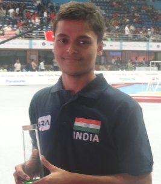
<p>Kid you not, he was the link between all of us above. Take him out, and everything fails. He managed the workshops, managed the inventory of all the parts and tallied the bills. Once done with his tasks, he jumped on with mechanical and electronics teams and contributed to great extents to all the robot designs. He knew the sizes of bolts, the value of resistors (cost in ₹ and resistance in Ω) and the torques of motors. He'd monitor and swap out batteries during practice runs, monitor and fix leaks from pneumatics, keep the compressor pressures in check. He'd mentor and onboard juniors with the software and types of components in use at the lab. Whenever he found the time, he'd try out some algorithms on his personal robot. He rolled with confidence after having gone through the roller coasters of international leagues. He traveled with Dhiraj everyday, for 3 hours, downtown and back. Struggles with robotics were something he wanted to put up with and fight for, and he'd ride the trains no matter how crowded. However, during one of the final exams, he decided that the train journey was not worth the hassle, and instead chose to go for a re-exam for it.</p>


Within each one above, the evident qualities in common were: Patience, showing up, executing and having each other's back. Because of the nature of the tasks we undertook, we often found ourselves in the high seas. As Tony Fadell puts it, "Being in the same lifeboat with people you truly respect, is purely a joy". Sharing a common goal with such a team is truly a treasure and a blessing. The world can flip on you but the team stays. During critical projects like Robocon, the responsibility of India's robotics efforts was on the shoulders of these 20-year-old sophomore undergrads.

I intend to add more to the page, hope to see you again if you liked to give the above a read.
