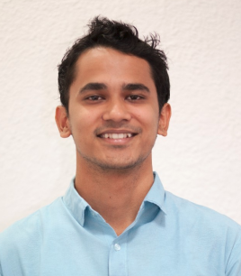

# Learnings
This section lists a few anecdotes from some past experiences mostly relating to tech. Learnings and stories never stop, so I intend to keep updating this page as I go. Each section below was a lesson learnt the hard way and hence I also share the experiences/stories behind each lesson to reinforce the ideas. A disclaimer: The stories below contain robotics jargon and do forgive me for geeking out. The stories might read like lessons learnt in the field of robotics, but I can assure you, at the core, the lessons stem from us just being the humans that we are. Most of the stories below are from my time at the Society of Robotics and Automation (SRA) at VJTI, back in 2013.

## Lesson 1: Characterizing failure modes
I learnt that taking the time to characterize the existing failure modes among critical components and drafting a safe counter-strategy saves a great amount of time and energy. Only by having this layer figured out, should a team focus on building more on top.

At SRA, back in 2013, instead of making custom joysticks for controlling robots, we started using PlayStation 2 joysticks (Fig. 1) as input devices for controlling our robots. Multiple switches and buttons of the joystick were mapped to various actuators on the robots. For e.g., each hat of the joystick had two axes, `x` and `y`. These axes were plugged directly into the ADC channels of our robot's µCs. We mapped our robot's driving motors to these axes, so we could navigate around the arena just like in a video game. The more off-center the joystick is, the faster the robot travels in the arena.

<div style="text-align:center"><br><em>Fig. 1: Left: Pinouts from the joystick, Right: Sony PS2 joystick (source: Tech monkey business)</em></div>

Surprisingly, after doing so, we often found our robot running haywire across the practice arena as if it received an incorrect signal. However, given that we were pressed for time, even with the knowledge of this, we kept adding and building more functionality on top without fixing such a crucial issue. One fine day, the robot did crash, seriously damaging our heavy-duty actuators, pneumatics and wiring harness. This increased the anxiety of the entire team for the upcoming league matches that were staged against hundreds of universities around India. Accidentally, the software team found out the pattern behind this, realized that there would have been momentary disconnections in the harness which send such an arbitrary signal to the µC. We pulled up the ADC channels on these pins and caught this exception i.e. assume the joystick to be disconnected when the readings are saturated.

```c
while (!(((left_hat.x == 0xFF) && ((left_hat.y == 0xFF))) ||
         ((right_hat.x == 0xFF) && (right_hat.y == 0xFF)))) {
    // Execute robot control code if signals are not saturated
}
```

With this, we could skip sending incorrect commands to the robot when the joystick was unplugged since the ADCs instantly went to a pull-up value of `255`. Then onwards, the robot just paused on the field when such a disconnection occurred. Would this have been looked at carefully instead of rushing to build more on top, we could have avoided keeping the teams on their feet while the robots were practicing at 3 am in the test arenas. The limited time in our practice slots was subsumed by repeating runs and hoping for miracles. To avoid such scenarios in the future, we kept pulling up the signal pins of sensors to diagnose failures. The approach did not always work, especially when we realized we blew 4 expensive distance sensors (Sharp GP2Y0A21) because of reverse currents from the MCU to the sensors. A careful read of the datasheet would have saved our sanity, time and money.

In another instance, we often returned to SRA in the morning only to find a batch of discarded LM7805s. On retesting them, we were surprised to see that each one of them worked perfectly! It was almost funny - in days of such tight budgets - someone was throwing these poor chips out?! Back in 2012, we had arrays of LM7805 LDOs powering various sensors and switches placed throughout the robots. While prototyping, there were chances of shorts or excess current draws which would instantly overheat the LDOs. The regulators could heat up to as high as 120 °C before entering something called a thermal shutdown. There might have been some hysteresis on this, keeping the ICs non-functional until they cooled down near room temperature. By then, the students would have identified this regulator as a cause of failure and blatantly replaced it with a newer regulator. Had we spent time reading the datasheets of this obvious component - especially the section on thermal shutdowns, we could have prevented discarding perfectly functional components.

Another story where knowing the root cause of a problem helped us take good design decisions, was when we picked our motor controllers. After burning through a couple of motor controllers during practice runs (Fig. 2), we learnt more about motors, motor drivers and battery sizing. At times when motors hit end stops, they stalled momentarily and drew excess current from the battery via the motor drivers. The expensive motor drivers (₹ 2500 each) then instantly burned through, letting out a dangerous spark.

<div style="text-align:center"><br><em>Fig. 2: Drawing excess current through motor drivers (source: TheCuriousOne)</em></div>

We skipped reading out from the current sensing pin of the motor drivers which usually helps keep power delivery in check since we always ran short of pins on the µCs (i.e. the familiar struggle for every embedded engineer, the dearth of pins). On using very capable lithium polymer batteries on our robots, the motor drivers burnt through their MOSFETs at the mercy of their poor internal protection mechanisms. We instead settled on cheap, heavy and low current 12V lead acid batteries, which also hilariously, served as a counterweight for the structure of the robot. Even if the motors stalled, the motor drivers only drew as much current as the lead acid sourced, far less than the rated amperage of the motor drivers - saving us from expensive burn-downs. Eventually, we transitioned from 12V to 24V supplies, which helped in fewer heating problems and a lower current could be sourced for the same power. The harness got easier, the wire gauge could be smaller. However, nowadays much better motor controllers are available in the market than the old Hercules/VNHS from ST Micro and such problems are not common.

Another story with the software team now! Back in 2013, we moved away from bare metal firmware and started writing our own library for AtMegas, which enabled us to call functions instead of obscurely writing into registers. We called the library `sra.c`, while we had another `main.c`, which ran a single CPU task, with everything inside a `while(1)` and without any delay. CPU utilization? A 100%! To be honest, our toolchain and embedded board could do quite a lot - build firmware without extensive setups and flash it from a CLI onto an accessible ISP programming port. We could read out from ADCs with apt resolutions and sampling rates, connect PlayStation joysticks, write to 16x2 LCDs, set duty cycles for ESCs, servo motors, control pneumatic solenoids, switch H-Bridges and other I<sup>2</sup>C/SPI related peripherals. However, we completely missed the functionality to provide debouncing to our limit switches, smooth out our sensor measurements and most importantly use any instantiable data structures for each hardware component. Result?

<iframe src="https://www.youtube.com/embed/XozfTtQIZjU?rel=0&amp;controls=0"
        frameborder="0"
        allow="accelerometer; autoplay; clipboard-write; encrypted-media; gyroscope; picture-in-picture"
        align="left"
        style="padding: 10px"
        allowfullscreen>
</iframe>
<iframe src="https://www.youtube.com/embed/X-0vHquG6vE?rel=0&amp;controls=0"
        frameborder="0"
        allow="accelerometer; autoplay; clipboard-write; encrypted-media; gyroscope; picture-in-picture"
        align="left"
        style="padding: 10px"
        allowfullscreen>
</iframe>

<br><em>Fig. 3: Bouncing recorded on the outputs of a commonly used button (source: BaldEngineer)</em>

In the video above, we based the entire state machine of our code on reading **un**debounced switches, resulting in the robot falling off the poles.

Another common failure was when we shared power rails between sensors and actuators and observed more noise while sampling sensors. We could only narrow down this problem years later because of absence of an oscilloscope (which by now should have been eminent that we couldn't afford). To peek into the issue, we were able to borrow one from our university lab (after a lot of paperwork). On connecting the oscilloscope to one of our sensor's pins, we were surprised to see a superimposed waveform on top of the sensor's analog signal. We could quickly identify that the waveform was originating from the switching PWM frequency of our motors. We used separated voltage rails and regulators with increased capacitance to solve this issue. The aforementioned "ghost clicks" in Fig. 3 could have also originated from the absence of debouncing, sampling at the CPU clock rate of 80 MHz and failing to isolate the switch's signal from the actuator's power supply rail. Would we have learned to trigger capture on the oscilloscope earlier, we'd have been able to diagnose, learn, patch and move on.

The part that was common in all the above anecdotes, was that we kept retrying practice runs without solving the root causes. And the worst part about retrying was that when the bytes (and stars) aligned, our runs worked out. A good practice run somehow provided enough reinforcement to let the underlying failures linger. We had little clue that we were breeding failure as we built more on top everyday. Our response to facing failures was often to "try the run again", and patch the symptoms, not the root cause. We hadn't developed the aptitude, curiosity or patience to deal with such root causes. Our thinking process, mentorship and experimentation tools for debugging were still preliminary. The issues were mentally noted and if they qualified as minor hindrances, they were simply not taken seriously enough. At the end of the build season, such unaddressed and lingering issues seeped into the confidence of the team. Confidence, in yourself, in each other and the robot is key for putting up the best of yourselves at the finals - and we missed that.

A failure, in my opinion, can be characterized ~~early~~ on time, by assessing the consequences of it subjectively than objectively. A failure of a switch is not only a failure of a switch but can lead to a broken actuator, trigger a fiasco in the software team, increase repetitive work for the mechanical team and seep into the faith of everyone. How can you know you are failing? "The thing about being wrong is, you never know how you are wrong" - Dr. Burry, The Big Short. My suggestion is that the thresholds for labeling an attempt a failure could be shifted earlier and diligent efforts could be made to search for mentorship, especially when a quick solution cannot be envisioned internally.

To confess, it was not all that gloomy - we shared laughs, responsibility for failures and stayed modest as we grew up as engineers and as a team. We reached the top leagues in the national competitions going up against 200 universities from all around the country by planning very simple strategies and navigating around our own shortcomings to face our able opponents. The two amazing robots we witnessed that year were: [Nirma Robocon 2014](https://www.youtube.com/watch?v=e_E5RlIjP10) and [Lac Hong Vietnam 2014](https://www.youtube.com/watch?v=GSJcOd8I6PU). These two runs might have been one of the most watched videos in my library.

## Lesson 2: Modeling and metric units

A simple mathematical model that uses metric units is crucial for communicating goals and ideas in systems engineering. These mathematical models do not have to be too sophisticated but can stay rather rudimentary. A goal could be as simple as moving 2 meters within 5 seconds or so. Such goals tend to harmonize the mechanical, electrical and software teams towards a tangible goal to optimize. For mechanical, they might realize that increasing wheel RPMs is not the best way to go faster, because of the torque limitations of the motor. Or that they might need to explore a [swerve drive](https://youtu.be/rNPtfMkFb7c). For electrical, it might mean using a motor controller that can accept deceleration by creating a short across the motor. Doing so would essentially pull the back EMF instantly to zero, and consequently oppose the cause of back EMF, i.e. free spinning of the wheel. Or maybe they need to improve the estimates of [motor encoders](https://curiores.com/positioncontrol) or install 1D SICK-laser rangers on the frame. For the software team, it could mean pushing the robots to follow motion primitives like velocity profiles and feedforward motor RPMs. The solution in the minds of each team differs significantly, however, aimed at the same goal. Using a metric unit can exactly assist with that - uniting everyone.

At SRA, we stored various thresholds for distance sensors, wheel RPMs and many such entities as a fictitious `const` defined somewhere in the files. Nothing was scaled/fused to metric units inside the software. I could see the benefits of doing so years later at [AlphaPilot 2019](https://nilay994.github.io/projects). Tangible physical quantities gave me a knack for what we expected the robot to do.

Before our very first drone flight at MIT's AeroAstro lab, I strode across the arena to almost cover a meter with every footstep. Only while running across the arena did I realize that the drone had only around 300 ms to react toward the first target, or it was too late. I captured pictures with blur and with bank angles of more than 45 degrees, where onboard images from the drone could have problems associating with the horizon. Federico later told me that my running around looked hilarious from the acoustically separated viewing box of the lab since it was difficult to make sense of what I was doing. But I can assure you that this frantic running around helped - the next day the drone was positioned at a yaw angle which directly pitched the drone towards the target, saving us a few milliseconds - critical in racing environments. During flight debriefings, the language often in use was "The current solution decreased mean velocity by *0.5 m/s* or that we reported a roll velocity of around *300 deg/s*, which caused the blur on the images". These numbers painted a picture for everyone of what we strove towards.

## Lesson 3: A strong baseline/platform to start from

*Tell me and I forget, involve me and I learn - Xun Kuang*. But our version was: "Tell me and I forget, show me how and I do it better than you". When our seniors first participated at Robocon, the software team programmed in assembly while the mechanical team built the chassis with wood. By the time we participated, we had a microcontroller abstraction library, AtMega 1280s (two separate controllers, connected via SPI to increase pinouts), and aluminium chassis with rivets for quickly prototyping our robots. This gradually transitioned towards the famous STM32s, PlayStation joysticks and brazed aluminium (ensuring 4 point contact for our omniwheels). Each of these listed improvements required us to venture out and religiously observe others who were doing better than us - forcing us to factor in these improvements. A new batch will likely feel the urge to reinvent the wheel when platforms are unreliable. Offering a reliable and scalable platform to the following batches should hence be one of the core responsibilities of a student team. Each batch needs to build on top of the previous and pass on learnings as an abstracted platform to the next batch. "The worries of today should be abstracted out tomorrow, for tomorrow is for building on top of today" - me.

Another good example of each year building on top of the other is the [Forze IX](https://www.forze-delft.nl/), the fastest hydrogen race car in the world, built over 3 long years. Fuel cell technology is incredibly complicated and yet a student team cracked the challenge. Industry expertise and senior's mentorships are like being born with a silver spoon. It gives a team superpowers - almost an unfair advantage against any robotics teams they'd compete against.

## Lesson 4: A constant (assured) revenue stream

The senates of SRA were responsible for propagating the knowledge they gathered under the mentorship of the batches before them (Yet, most years not only saw a propagation of knowledge but saw revolutionary ideas that changed the narrative of SRA for years to come). Talking about our seniors, batch of 2014 and 2015, found a way to secure a constant revenue stream for the society. In days when the society's bank accounts ran dry, with no sponsorship or institutional support, this constant revenue stream meant everything to us. The idea was a workshop-based revenue model. It was simple, more robotics workshops = more funds. The batch of 2014 created a new company under which a 1-week robotics workshop could be given to around 300 students in and around the city. Fees were kept mindful to allow everyone for having access to such fun robot-building knowledge. The marginal profits generated were still enough to source robot components from all over the world. That batch's entrepreneurial ability at such a young age was contagious. We continued it for the years to come and improvised upon it as well. We used batch manufacturing, enriched the slides to keep workshops interesting after lunch, managed an inventory, marketed the workshop and designed PCBs in a way that made it difficult to mess up (short-out).

## General learnings

A few general lessons that I could pick from this experience were:
- Planning is essential. When goals get stressful, it is important to plan more in the short term. Concluding today and planning tomorrow. Long-term visions can be held, but short-term goals were the only ways to achieve them.
- Finding ways to challenge everyday work by searching outside the bubble of the mundane. Getting mentorship. Breaking the unguided inertia. Questioning the solution everyday, striving to find answers everyday. Evaluating and failing fast. Reducing the unknowns while reaching the target.
- The "chalta hai" (it'll be fine) and "ho jayega" (will work out) attitude had to be thrown away. Indifference to inefficiency should not linger around too long.


# Team
We loved to come to the lab everyday, make small progress or even **un**progress everyday, most often seeing our ideas not working out and some days be utterly surprised by what we made together. We strove for including all disciplines of engineering and also all genders. The latter being more challenging to achieve for various reasons - (will write about it soon). The team in recent years has been brilliantly diverse and saw great contributions from women as well. Our team consisted of not only the members that are listed below, but also our seniors and juniors without whom our ambitious projects could not take shape. However, we did wish we had a bigger and more diverse team, for we could have delegated more, built better and had more fun together.

## Udit Patadia

<p>An introduction to SRA's 2016 batch should start with Udit Patadia. In his early years, he led the mechanical team of SRA. It was magical how quickly he came up with a design, cut and rivet aluminium pieces together with the utmost quality. His directness was astonishing - leaving out no room for ambiguities to exist in the quality of execution. Pleasing others often came dead last in his priorities since it was usually about surprising himself with his own efforts toward any task. His passion persisted regardless of external validation. In our international leagues of Robocon 2014, while the stadium was filled with cheers from more than 10000 people, he was one with the robot. He didn't feel any tremble and his movements stayed graceful, as he steered the robot to one of the best performances the robotics chapter of VJTI has ever put up. After this stint, he took on building a huge CNC machine for prototyping future robots. Shortly after, he found his love for software in the newly released ROS beta in his newly installed Ubuntu partition. His contributions to the lab continued even after his graduation in 2016 and his philosophies are distinctly visible when we read SRA’s annual newsletters. No matter where he is now, I remember that he once took an entire exam in analog electronics where his calculator was stuck in the less-known "gradient" mode, giving him entirely different numbers than what we filled in as degrees.</p>

## Rahul Solanki

<p>The lead for software. I remember meeting him first when he surprised seniors by memorizing the datasheet for the AtMega32 processors we had in the lab. He was the first one amongst us to join SRA and quickly started exploring the libraries for our embedded systems. His ability to keep his calm in a crisis and churn out hex firmware from the newly patched C code was beyond impressive. He could spot multiple anomalies inside the code from a single trial run. He knew which subroutines to alter and committed to it even when our practice slot would be due in the next 15 minutes. He built a pulse oximeter during his internship at MIT-REDx and mentored several junior teams on the side. Being displeased with the challenge offered by amateur microcontrollers we used on our robots, he learnt Java and Matlab within a week. He built Android applications and inconsequentially found various ways to segment the foreground from images using computer vision. Difficult to forget his "can be motivated today, can learn tomorrow, can execute day after" attitude coupled with humour - reflecting his light take on life while being one of the smartest in the room. He spent sleepless nights with us at the lab, and while we would struggle with exams the next day, Rahul would somehow always find himself in the top 5 percentile of the class. He now works on facilitating AI technologies at the biggest companies in Silicon Valley. No matter where he is now, I remember that he never agreed to edit his code for swapping a few pins in the microcontroller’s code when there was a mixup, leaving us to fix all the connections in the robot's wiring harness.</p>

## Kewal Shah

<p>Our electronics lead - the most proficient in embedded firmware amongst us. He handled one of the most crucial operations of the society - the workshops. After he designed the PCBs for the workshops that would teach robotics to 400+ students of Mumbai that year, he would juggle with quotations from electronics suppliers, project profits from the workshop and estimate if they'd be enough to pursue the year's ambitions. Be it analog design or revenues for the year - he went all flash with the calculations with the num-locked part of the keyboard. Several projects followed for him, like the wrist-watch multimeter and swarm robots on LiFi. During our international leagues, he could briefly bend over and spy on our opponent’s robots to identify a plethora of sensors and microcontrollers which would be crucial for our next robot designs. You could know if Kewal was frustrated when you hear eloquently articulated swear words, providing both clarity and motivation in a single sentence about what had to be done further. The eloquence of the crafted sentence was directly proportional to how "off" you were from what was expected. After blowing up a variety of components in the practice arena, Kewal often received a list of components to buy the next day when the electronics market opened in Grant Road, Mumbai. This often implied missing the first lecture of the day. We can almost establish a relation between a drop in his test scores and that course falling early on our timetable. Right after his bachelor's, he moved to the semiconductor heaven, China. Working in Shanghai, he now sponsors the most significant part of the robot - the central microcontroller. This is key to SRA's workshops, knowledge transfers and embedded proficiency. It is one of the most advanced microcontrollers there is in that form factor in the world. No matter where he is now, I remember him being very positive about political reforms in the country until he was asked for a bribe by the customs for unfreezing our imports.</p>

## Dhiraj Patil

<p>Also our electronics lead and the most hardworking amongst us all. He commuted 3 hours everyday, (including weekends) in the notoriously overcrowded local trains of Mumbai to sharpen his proficiency in analog electronics and robotics. He was, yet, the first one to arrive and the last one to leave. I remember a day when he was posed with an excessively complicated power supply design problem. He had a week to finalize the schematics and manufacture a PCB for a 7V 20A power supply for one of the robots of Robocon 2014. He came up with a complicated yet functional design that worked exactly as expected (though we added a few cooling fans to keep his transistors safe). He used to also on the side run an apprenticeship for installing CCTV systems around the city. As he grew more confident in his proficiency, he quickly wanted to bring it to use in society. He started providing electric wheelchairs with electro oculography based inputs for quadriplegic patients which also caught the attention of local newspapers. After his study, he went on to build revolutionary point-of-sale devices when India was making digital payments a convention. After patenting his device, he moved on to build point-of-sale devices for one of the big names in the industry. No matter where he is now, I once caught him soldering a matrix board with ICs already mounted on the IC beds and he couldn't spot what was wrong.</p>

## Anshuman Singh

<p>Kid you not, he was the link between all of us above. Take him out, and everything fails. He managed the workshops, managed the inventory of all the parts and tallied the bills. Once done with his tasks, he jumped on with mechanical and electronics teams and contributed to great extents to all the robot designs. He knew the sizes of bolts, the value of resistors (cost in ₹ and resistance in Ω) and the torques of motors. He'd monitor and swap out batteries during practice runs, monitor and fix leaks from pneumatics, keep the compressor pressures in check. He'd mentor and onboard juniors with the software and types of components in use at the lab. Whenever he found the time, he'd try out some algorithms on his personal robot. He rolled with confidence after having gone through the roller coasters of international leagues. He traveled with Dhiraj everyday, for 3 hours, downtown and back. Struggles with robotics were something he wanted to put up with and fight for, and he'd ride the trains no matter how crowded. However, during one of the final exams, he decided that the train journey was not worth the hassle, and instead chose to go for a re-exam for it.</p>


Within each one above, the evident qualities in common were: Patience, showing up, executing and having each other's back. Because of the nature of the tasks we undertook, we often found ourselves in the high seas. As Tony Fadell puts it, "Being in the same lifeboat with people you truly respect, is purely a joy". Sharing a common goal with such a team is truly a treasure and a blessing. The world can flip on you but the team stays. During critical projects like Robocon, the responsibility of India's robotics efforts was on the shoulders of these 20-year-old sophomore undergrads.

I intend to add more to the page, hope to see you again if you liked to give the above a read.
