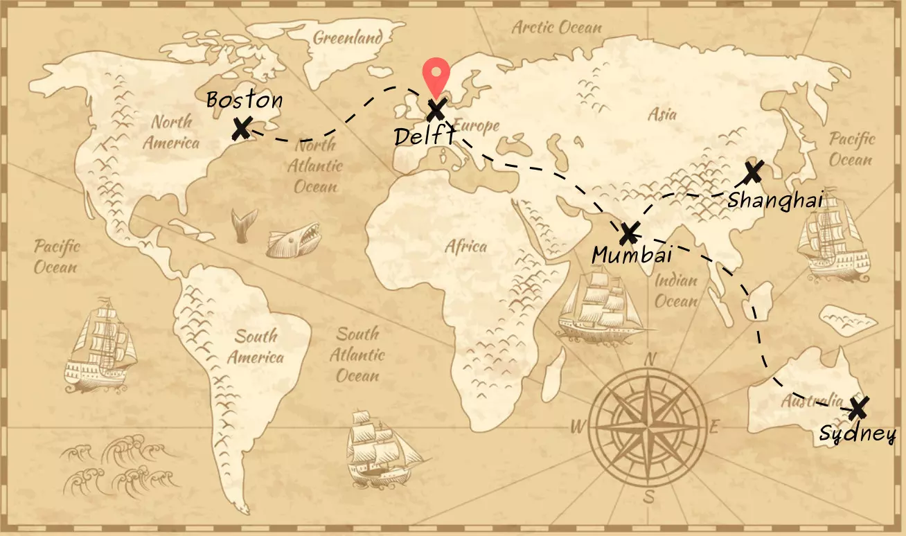
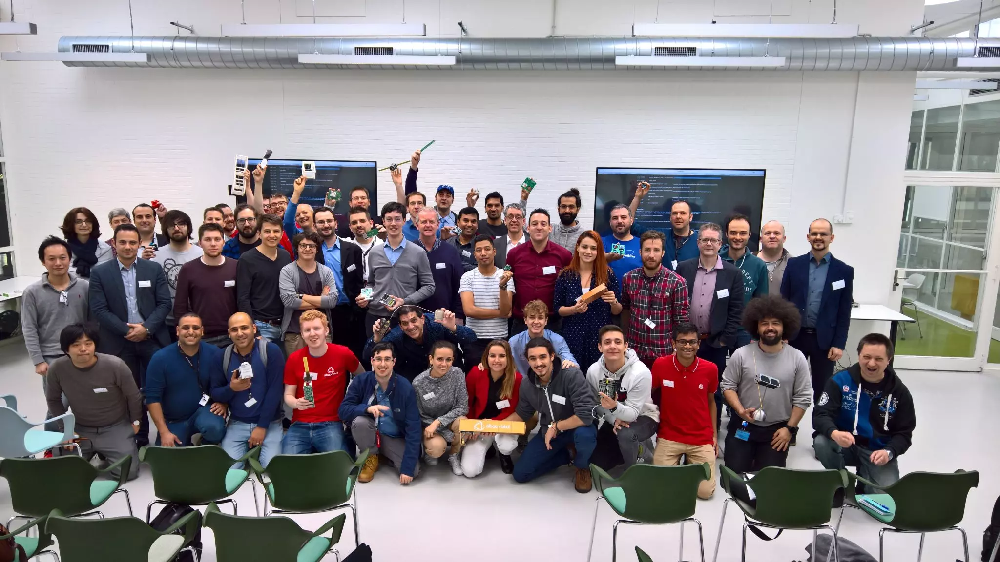

# Projects

 <em>Presence footprint</em>

***A few pictures in the slides below are hyperlinked, so click away on the moving pictures if you like the project! :P***

## Hydrogen fuel cell systems (2021-2023)
Electric vehicles offer a zero-emission power promise. However the prevailing challenges related to battery sizing, sustainable battery manufacturing and charging time appear when EVs are used for heavy duty applications. Bigger batteries for heavy duty applications increase the weight of the vehicle significantly, in turn decreasing the range.

Hydrogen, being one of the most energy dense & lightest elements, scales reasonably with a bigger power demand, is quick to refuel and reduces reliance on big batteries while still living upto the zero emission promise. In a fuel cell system, as hydrogen and oxygen combine to produce water, both electricity & heat are released. Electricity is used to power the vehicle & heat can be used to condition the temperature in the vehicle.

This power plant requires a number of compressors, heaters, inverters, valves, sensors & DCDC converters to be orchestrated perfectly to power the vehicle. A central computer (ECU), manages the communication with the vehicle, estimates various physical entities based on sensor measurements, controls various internal actuators depending on the power demand and determines the operating condition of the plant. Most of this software was safety-critical & requires compliance to various standards. This brings the attention to test driven embedded systems development along with the need of various support and analysis tools. Part of the embedded team, the above tasks were our responsibility.



## AlphaPilot (2019)
Make drones fly at the limits of flight to finish a race in the shortest time, autonomously. Won **$1M** competing against 400 research groups around the world. This challenge is introduced for staging AI against the top-most drone pilots of the world. The competition not only evaluates the competitive-ness of the deployed algorithms, but also gives researchers a chance to change the perspective of the pre-existing sport. This change of perspective towards a game took place earlier when DeepMind's AlphaGo beat the world champion Lee Sedol in 2016. Computers are capable of making decisions which are rather unanticipated by humans but in the end have a higher probability of winning. Such unconventional moves have led to a complete change of perspective in the 300 year old game of Go. AlphaPilot poses a slightly different technical challenge as compared to these game based AI algorithms by the introduction of real-world robot dynamics. While trying to increase the probability of winning, it must send tireless continuous millisecond signals which are not only responsible for making them fly the fastest, but also for fighting against pseudo forces, drag and gravity to maintain their stable "upside-up" configuration.



&nbsp;

## Percevite (2020)
[PercEvite](https://percevite.org): Sense and Avoid for small + unmanned aerial vehicles. Each drone is its own Air Traffic control. Project under [Single European Sky Initiative (SESAR)](https://www.sesarju.eu/projects/percevite).



&nbsp;

## PocketCube, TU Delft Space Institute (2018)
Implemented [detumbling algorithms](https://github.com/nilay994/detumble) using the ADCS (Attitude Determination and Control) subsystem on the Defli-PQ (PocketCube)
- MSP432 firmware for control systems and telemetry
- Magnetometer calibration and IMU sensor fusion
- B dot detumbling algorithm
- MATLAB simulations with HiL support

  
 <em>PocketCube Workshop Delft</em>

&nbsp;

## Espressif, Shanghai (2016 - 2017)
Position: Firmware/Applications engineer

Contributing to the firmware development of the famous [esp-idf](https://github.com/espressif/esp-idf) for the ESP32 chip!
- FreeRTOS
- HMI/LCD drivers
- Linear Algebra library support for ESP32
- Audio Processing for voice services
- Benchmark Tests for FLOPS
- Worked on SPI Master Slave bugs on the older ESP8266
- Motor Control Drivers: BLDC, brushed, stepper, servo
- Amazon Web Services MQTT-IoT



&nbsp;

## FIRST Robotics Stronghold, Sydney (2016)
Position: Coach of the team FRC6024, representing India internationally once more!
- Designing the control systems for drivetrain of the robot
- National Instruments RoboRio, using the nice WPILib firmware



&nbsp;

## Robocon, Asia Pacific region (2013 - 2016)
Position: team captain, International Robocon 2014
- Prototyped 4 robots throughout the build season
- Control Systems, PCB layouts, Embedded Programming, Pneumatics
- Conducted embedded/robotics systems workshops for 300+ students around Mumbai

(Usually just spent sleepless nights converting whiteboard ideas to real life robots)



&nbsp;

## archived projects



&nbsp;
&nbsp;

[go to Publications](./publications)

[back](./)
