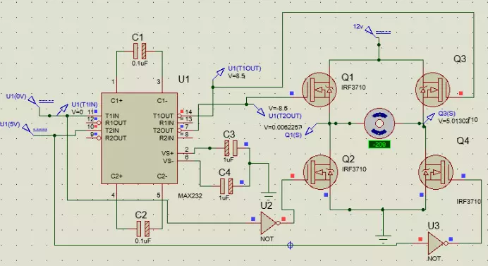
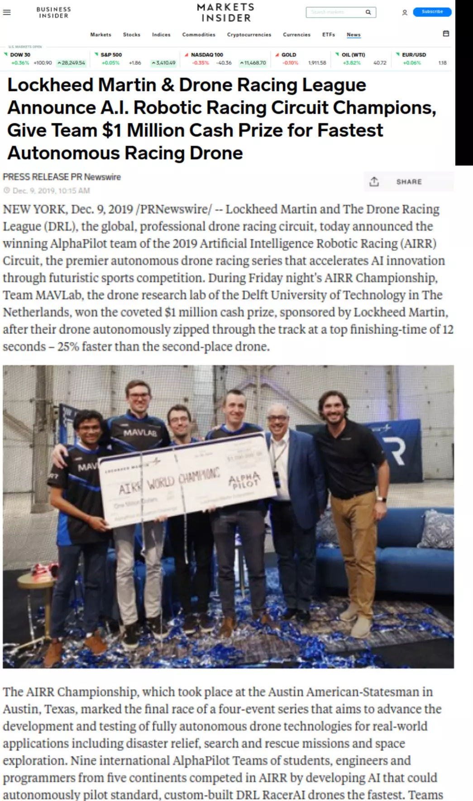
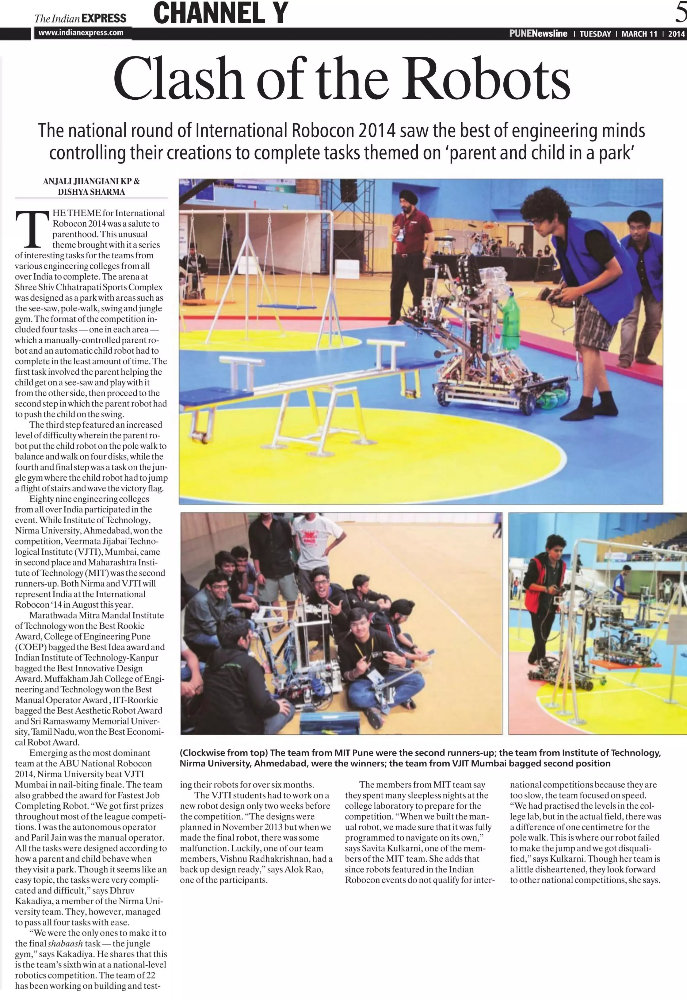

# Publications
_yay!_

<h3>- Artificial Intelligence behind the winning entry to the 2019 AI Robotic Racing Competition</h3>
<iframe src="https://www.youtube.com/embed/2H1Eo8DTepg"
             frameborder="0"
             allow="accelerometer; autoplay; clipboard-write; encrypted-media; gyroscope; picture-in-picture"
             allowfullscreen>
</iframe>

<desc>Presents the winning solution of the AI Robotic Racing (AIRR)'s fully autonomous drone races.</desc>

The core approach during this research was inspired by how human pilots combine noisy observations of the race gates with mental models of the drone's dynamics to achieve fast control. It achieved so by focussing on gate detection with an efficient deep neural segmentation network coupled with robust state estimation and risk-aware control. Reaching speeds of ~9.2m/s, the solution remained unrivaled by any of the previous autonomous drone race competitions. Despite this, it lost against one of the fastest human pilots, Gab707. The presented approach indicates a promising direction to close the gap with drone pilots, forming an important step in pushing smart vision and advanced control techniques to the real world.

<a href="https://arxiv.org/abs/2109.14985" target="_blank" rel="noopener noreferrer">Link</a> to the paper. <a href="https://www.nature.com/articles/s42256-021-00405-z.epdf" target="_blank" rel="noopener noreferrer">Comment</a> by Nature Machine Intelligence.

<h3>- Control for autonomous drone racing</h3>

<desc>Focuses on optimal control and trajectory planning for racing drones and was used in the development of the winning paper above.</desc>

Racing drones in use are agile autonomous platforms that operate at the limits of computational perception abilities while being at the edge of their aerodynamic flight envelopes. Such challenges make the field of autonomous drone racing prominent among research groups around the world. These races aim to push the boundaries of perception and control algorithms, while simultaneously mitigating the real-world uncertainty of execution on autonomous systems. While perception algorithms face challenges due to limited feature detection, high motion blur and computational requirements, control algorithms face challenges of planning trajectories that squeeze out every millisecond there is and still safely obeying those commands. This thesis addresses the challenge of control for racing, which is responsible for guiding drones to quickly design and track time-optimal trajectories for fast flights. 

<a href="https://repository.tudelft.nl/islandora/object/uuid%3A99f41ef5-f2c9-4a0a-9b89-0245e106f6de" target="_blank" rel="noopener noreferrer">Link</a> to the thesis.

<h3>- Li-Fi swarm robots with visual odometry</h3>

<desc> Demonstrates closed loop control via Li-Fi/VLC with an overhead tracking camera in a swarm environment.</desc>

Li-Fi can transfer data by modulating the intensity of light at imperceivable rates. Motivated by the looming radio frequency spectrum crisis, this project aims to demonstrate that Visible Light Communication (VLC) provided enough bandwidth for closed loop control of multiple robots for indoor RF-free environment. The paper describes the approach used to exploit off-the-shelf components for facilitating a simplex VLC communication. Also discusses a few swarm algorithms which could be tested with the simple localization and control setup. 

<a href="https://link.springer.com/chapter/10.1007/978-3-319-67934-1_18" target="_blank" rel="noopener noreferrer">Link</a> to the paper.

<h3>- Motor driver using charge pumps</h3>

<desc>Paper presents an embedded system driving H-bridge configuration using charge pumps</desc>

 After burning through a couple of motor drivers, quickly tried making one ourselves. N-channel MOSFETs and charge pumps together eliminate the problems of Dead time of MOSFETs and High values of RDS (ON). The embedded system using an ATMEL μC drives the load and monitors the voltages and input PWM to establish a closed loop system by comparing it with the stored threshold state space parameters of the motor, in turn preventing MOSFET damage by synchronized control over the gates.

<a href="https://ieeexplore.ieee.org/abstract/document/7443724/" target="_blank" rel="noopener noreferrer">Link</a> to the paper.

### **- Other projects**
Control and embedded systems interface for
- [CNN-based Ego-Motion Estimation for Fast MAV Maneuvers](https://arxiv.org/abs/2101.01841)
- [Neuromorphic control for optic-flow-based landings of MAVs using the Loihi processor](https://arxiv.org/abs/2011.00534).

* * *
## Clubs
- [Society of Robotics and Automation](https://sravjti.in/)
- [MAVLab](https://mavlab.tudelft.nl)
- Innovators Club of India
- Also, posses a :golf: club

* * *

## News

- **AlphaPilot challenge**:
    [Business Insider](https://markets.businessinsider.com/news/stocks/lockheed-martin-drone-racing-league-announce-a-i-robotic-racing-circuit-champions-give-team-1-million-cash-prize-for-fastest-autonomous-racing-drone-1028747953#), [Lockheed Martin](https://www.lockheedmartin.com/en-us/news/events/ai-innovation-challenge.html), [WIRED magazine](https://www.wired.com/story/coders-versus-human-pilots-drone-race/) and [Bloomberg](https://www.bloomberg.com/news/videos/2018-09-05/lockheed-martin-looks-to-drone-racing-for-the-next-advance-in-ai-video).

    

    &nbsp;

- **Undergrad robotics chapter**:

    
    
    

[go to projects](./projects)

[home](./)
