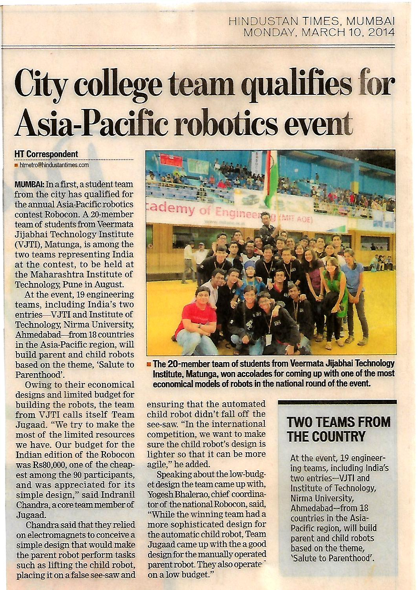

## publications
_yay_

* * *

### papers
1. [control for autonomous drone racing](https://repository.tudelft.nl/islandora/object/uuid%3A99f41ef5-f2c9-4a0a-9b89-0245e106f6de)
2. [lifi swarm robots](https://link.springer.com/chapter/10.1007/978-3-319-67934-1_18) - good systems paper
3. [motor driver using charge pumps](https://ieeexplore.ieee.org/abstract/document/7443724/) - not very proud..

* * *

### clubs
1. [Society of Robotics and Automation](sra.vjti.info)
2. [MAVLab](mavlab.tudelft.nl)
3. Innovators Club of India
4. Also, posses a :golf: club

* * *

### news

2. TODO: nhk radio JP + dd unlisted youtube.

[back](./)
