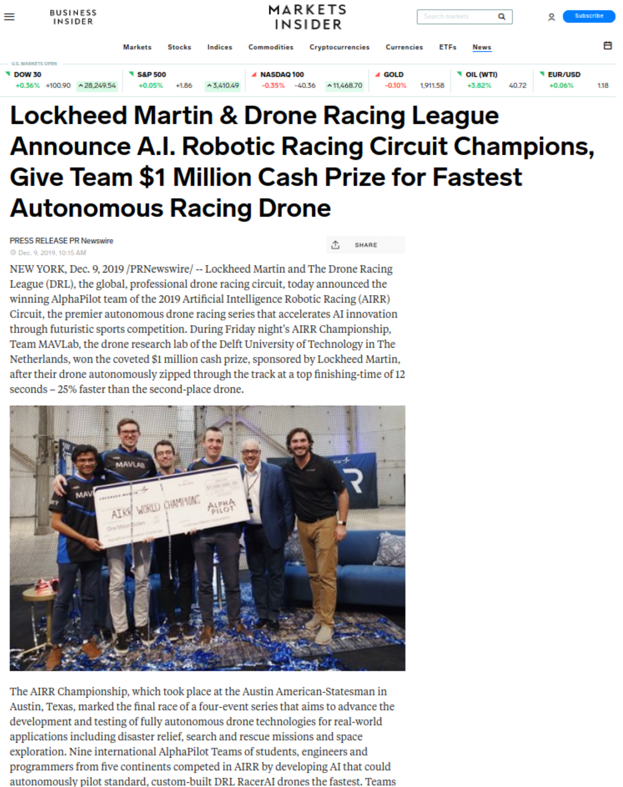

# Publications
_yay!_

## Papers
(1) [Control for autonomous drone racing](https://repository.tudelft.nl/islandora/object/uuid%3A99f41ef5-f2c9-4a0a-9b89-0245e106f6de)

Recently, drone races have gone fully-autonomous. As a result, these agile robotic platforms not only pose challenges of flying fast to the participating pilots but also create challenges for the flight control computers. As a result, the concept of autonomous drone racing has gained significant attention from research groups around the world. These races aim to push the boundaries of perception and control algorithms, while simultaneously mitigating the real-world uncertainty of execution on autonomous systems. While perception algorithms face challenges due to limited feature detection, high motion blur and computational requirements, control algorithms face challenges of convergence to the desired trajectories that are planned out in the race arena. This thesis addresses the challenge of control for racing, which is responsible for guiding the drone to design and track desired trajectories for fast flights.

(2) [Li-Fi swarm robots with visual odometry](https://link.springer.com/chapter/10.1007/978-3-319-67934-1_18) - systems paper

Motivated by the looming radio frequency spectrum crisis, this project aims at demonstrating that Visible Light Communication (VLC) has now reached a state where it can prove that it is a viable solution to this fundamental problem. VLC is a technique used for data transmission at very high speeds through light, which transfers data by varying its intensity at unperceivable rates. The proposed solution also establishes a closed loop with an overhead camera which mocks like a GPS in the swarm environment. Positional information of the robots is given by augmented reality tags and this data is fed-back to the robots via VLC. The paper elaborately describes the approach used to exploit off-the-shelf components for facilitating VLC. Overhead localization and the closed loop made here control each swarm robot with simplex communication. Problems faced while prototyping and overcoming them in revisions have been also described. 

(3) [Motor driver using charge pumps](https://ieeexplore.ieee.org/abstract/document/7443724/) - not very proud..

An efficient modeling of motor drivers using an H Bridge configuration driven by charge pumps controlled by embedded components is presented. N-channel MOSFETs and charge pumps together eliminate the problems of Dead time of MOSFETs and High values of RDS (ON). The embedded system using an ATMEL microcontroller drives the load and monitors the load voltages and input PWM to establish a closed loop system by comparing it with the stored threshold state space parameters of the motor, also in turn preventing MOSFET damage by synchronized control over the gates. Charge pump readings have been reported along with feedback readings for the microcontroller. Results obtained are in range with expected outputs.

* * *
      

## Clubs
1. [Society of Robotics and Automation](sra.vjti.info)
2. [MAVLab](mavlab.tudelft.nl)
3. Innovators Club of India
4. Also, posses a :golf: club

* * *
       

## News

### AlphaPilot challenge: 
[Business Insider](https://markets.businessinsider.com/news/stocks/lockheed-martin-drone-racing-league-announce-a-i-robotic-racing-circuit-champions-give-team-1-million-cash-prize-for-fastest-autonomous-racing-drone-1028747953#), [Lockheed Martin](https://www.lockheedmartin.com/en-us/news/events/ai-innovation-challenge.html), [WIRED magazine](https://www.wired.com/story/coders-versus-human-pilots-drone-race/) and [Bloomberg](https://www.bloomberg.com/news/videos/2018-09-05/lockheed-martin-looks-to-drone-racing-for-the-next-advance-in-ai-video).

### Robocon

1. add nhk radio JP + dd unlisted youtube.

[go to Projects](./projects.html)

[back](./)
