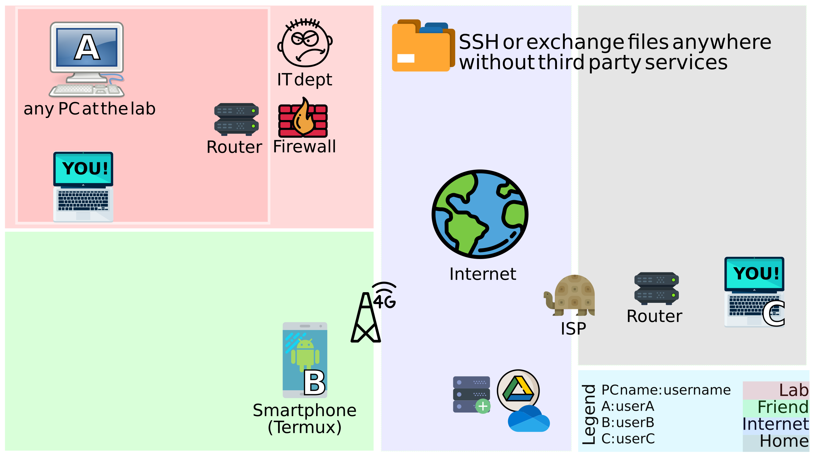
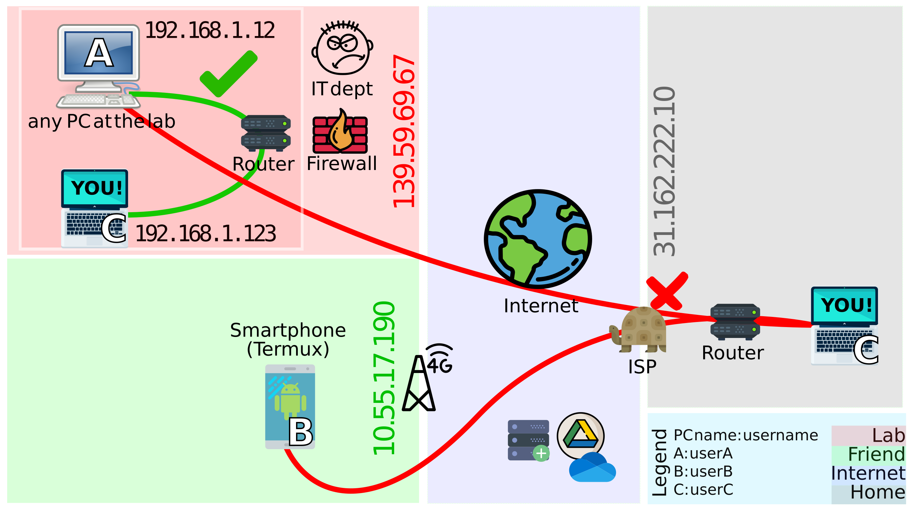
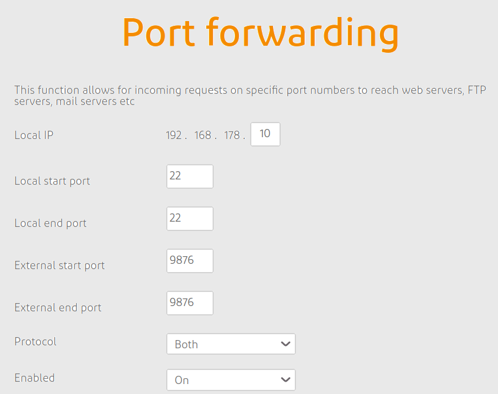
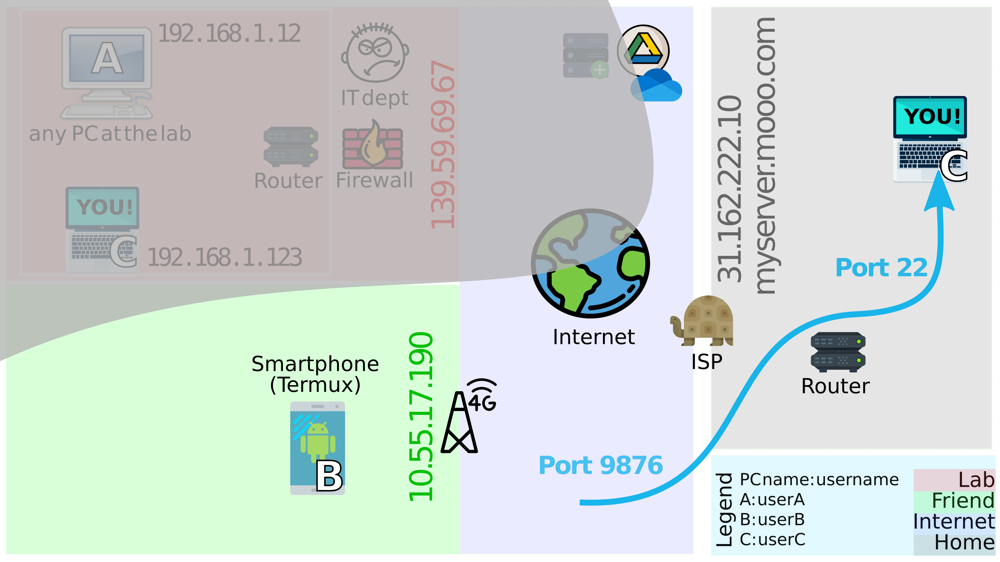
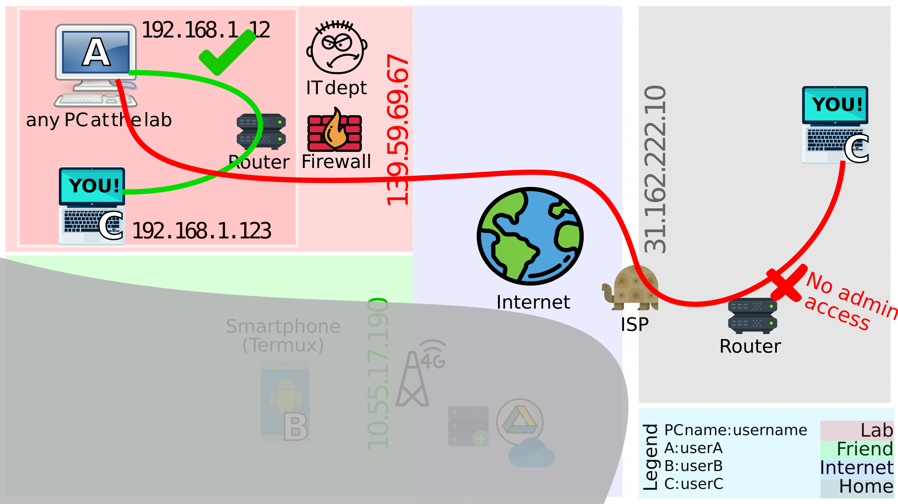
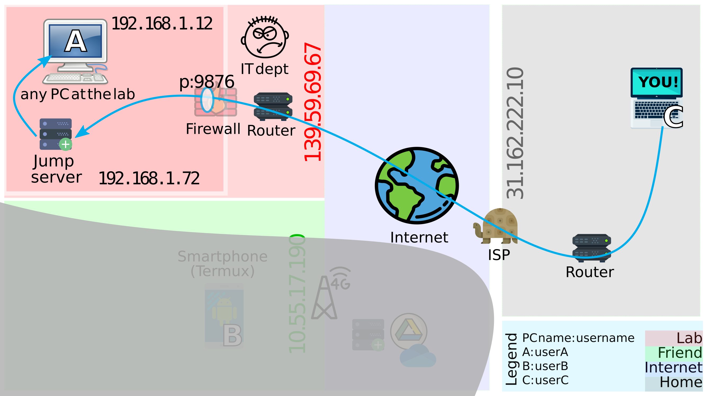
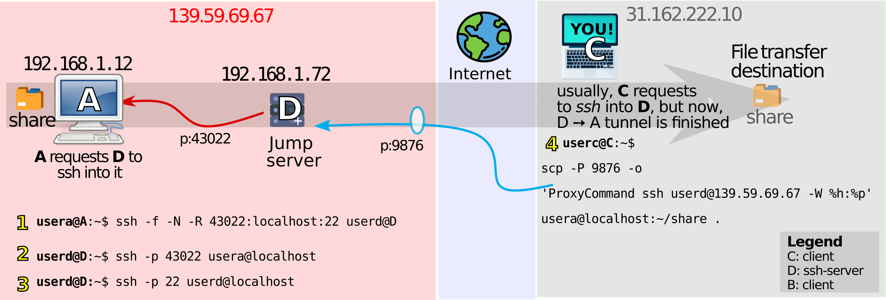

# ssh around 

For sending files over, most of us rely on cloud services like Google Drive or WeTransfer, and I find this a bit tiresome. I've found to dislike it for the inability of beaming files over directly to the destination without storing it. As a positive side-effect, such a feature would significantly reduce the storage requirement inside server farms by not having to store our useless data. After paying enough broadband fees for the internet infrastructure, it struck me that the internet protocol is free - and it can be used to route packets directly to a destination, like how the forgotten `ftp` has always done it. I explored this a bit in detail with the more secure/encrypted protocols (`ssh/scp`) and wrote down the learnings from it. Also, with the single-board linux computer revolution in robotics, many of us dump our post-run logs for analysis using these methods, so the steps could be useful there as well.

*Disclaimer: There is a high possibility that this page will frustrate someone; especially an expert in networking. The methods used here are quite preliminary and expose ports of a computer to the internet, increasing vulnerability to attacks. Security is the last thing this page is addressing (literally). There are a few steps mentioned at the end of this page to increase security while still preserving connectivity.*

Table of Contents
  - [Chapter 1: Scenario](#chapter-1-scenario)
  - [Chapter 2: Low hanging fruit first](#chapter-2-low-hanging-fruit-first)
  - [Chapter 3: Open your heart to the internet (connect `B` and `C`)](#chapter-3-open-your-heart-to-the-internet-connect-b-and-c)
  - [Chapter 4: Convince the IT dept (connect `A` and `C`)](#chapter-4-convince-the-it-dept-connect-a-and-c)
  - [Chapter n+1: Increase security 🔒](#chapter-n1-increase-security-)
  - [Chapter n+2: Connection metrics 📊](#chapter-n2-connection-metrics-)
  - [Chapter n+3: Other tricks](#chapter-n3-other-tricks)
  - [References 📖](#references-)

## Chapter 1: Scenario
The paragraph below only exists to motivate the usage of different methods by a scenario. If one manages to symbolically replace the scenario below with their problem statement, then the `ssh` commands listed here could be easier to translate. 

In the image below notice the following:

There are three computers and three associated users,  e.g. computer `A` has user called `userA`. Computer `A` will be refered to as `A` and the name `userA` would usually be used in commands, and must be replaced by whoever is `userA` for you. They are all connected in different ways:
   1. `A` in the red area is a computer at lets say, a lab. It is connected to the *blue* ocean of the internet, but only through a router, which goes to the firewall of a company - seems pretty restrictive. As a user, we'd never know if our company has such a hardware firewall, until we speak to IT. Maybe there never is a firewall or it just exists as a placebo to keep people in check.
   2. `B` in the blue area is a friend who is likely commuting, maybe connected to the internet via  a cellphone tower (2G/3G/4G). Commands for `B` were tested on an android smartphone, since 72% of us use an android operating system.
   3. `C` in the grey area is you, with a router connected to an internet service provider (ISP). A router or a modem is usually where the change of physical medium takes place. For e.g. a place where a wifi/ethernet cable gets converted to a fibre optical cable or a satellite dish connection. In case there is more than one hop (i.e. intermediate router/switch) between `C` and the ISP, **one must still have the access to the *main* router for this to work**.

<div style="text-align:center"><br><em>Figure1: Different computers in different networks wanting to exchange a file</em></div>

For checking if there is an intermediate hardware-firewall/switch/repeater/hub/router between a computer and the *main* router that is connected at the interface (i.e. change of physical medium as mentioned above). Maybe one could run a `traceroute` command, to see if a packet takes more than one hop to surface to an external ip address? 

## Chapter 2: Low hanging fruit first
In the image below, notice which connections could be established easily and which ones not:
1. A connection between `A` and `C`  can be easily done while both are connected to the same router at work[^1]. Notice the red box around `A` and `C` when at work, indicating they are in the same local area network.
2. The moment `C` is brought on a different network, i.e. in the grey area, it can no longer connect to `A`. It also seems like the firewall at the lab might get in the way while getting this to work.
3. The same goes for `B` and `C`, since they are not on the same local network, `ssh`ing into one another isn't straightforward. But it seems like the IT dept is not here to police around, so lets try to establish connections between `B` and `C` first.

<div style="text-align:center"><br><em>Figure2: What can be connected straightaway ✅ and what cannot ❌</em></div>

[^1] Maybe even a router isn't needed to connect `A` and `C` in the red area. Two computers can directly be connected using a single ethernet cable, but in the absence of an IP resolver like a router,  the IP addresses for both `A` and `C` must be static and in the same subnet mask. Also, the ethernet cable that might be required could be a crossover-cable.

## Chapter 3: Open your heart to the internet (connect `B` and `C`)
I've experienced that asking people to hand out their credentials or to asking them to follow multiple steps could discourage them to try out our nice method. So the efforts could stay focussed on `C`'s side than `B`. Only one of them needs to follow the steps below. So, what does `C` have to do to make `B` connect to it? In such an arrangement, `C` becomes the server side and `B` becomes the client side.
1. Allow incoming connections to `C` by opening a port on the *main* router. PC Magazine defines Port forwarding in the following manner:
   > *"Port forwarding is commonly used to make services on a host residing on a protected or internal network available to hosts on the opposite side of the gateway (external network), by remapping the destination IP address and port number of the communication to an internal host." bala-bala boom technical skip~~*

   Here is an example of a router configuration page ready for opening a port, which usually located on the address `192.168.0.1`, and can be accessed through a browser. *(Sidenote: If router settings are not accessible, then Chapter 4 could be helpful)*

   <div style="text-align:center"><br>
   <em>Figure3.1: Router settings</em></div>
      
   The snip above advices that one can refrain from using the default `sftp`, `scp`, `ssh` port numbers like port 21 or port 22 as an external port. For security, it is standard practice to use a higher arbitrary port number. If there are multiple locals computer that require to be accessed, then one could choose a different external port for that particular local IP, which again maps to the new computer's local port 22.

2. After a successful creation of a port forwarding rule, an `ssh` server can start running on `C`. If its the first time that such a connection is being established, it is recommended to [setup a public and private key](https://docs.github.com/en/github/authenticating-to-github/generating-a-new-ssh-key-and-adding-it-to-the-ssh-agent). An `ssh` server can be started on `C` with the following command:
   ```
   sudo apt-get install openssh-server
   sudo systemctl enable ssh
   sudo service sshd restart
   ssh userC@localhost
   ```
   With the last command, `userC` on `C` would `ssh` into itself, giving back the terminal after succesful login.
3. Now, the friend `B` who has `C`'s ip-address 🏠 (`31.162.222.10`) can arrive at the port ⚓ 9876 (set in step2). After arriving here, `B` can ask if `C` could help access `userC`'s files. If observed carefully, the bytes on Port 9876  are being mapped to Port 22 by the router in the grey area. Also, seems like `C` went ahead and got a domain name `myserver.mooo.com`, so `B` doesn't have to remember the address `31.162.222.10`, how thoughful is that ❤️.
   <div style="text-align:center"><br><em>Figure3.2: Global address to reach C: 31.162.222.10:9876</em></div>

1. After making `C` a global citizen, there are only two commands `B` has to enter in the termux application now:
   ```
   pkg install openssh
   ssh -p 9876 userC@myserver.mooo.com
   ``` 
   **or**
   ```
   ssh -p 9876 userC@31.162.222.10
   ```
   `scp` commands can follow from the above commands for intiating a file exchange. File exchange could be from `B` to `C` or from `C` to `B`. However, the initiative of exchanging files in either directions can only be taken by `B`. The command below copies `~/share/file1.txt` from `C`, onto `B`'s smartphone. The second command moves it to `B`'s sdcard. 
   ```
   scp -P 9876 userC@myserver.mooo.com:~/share/file1.txt ./
   mv file1.txt ~/sdcard/Downloads
   ```

After this point on, I started looking at `ssh` as a "request". This request can only really **reach** a server iff the router to which the server is connected to decides to forward such requests to it. Only after this point, the term Port-Forwarding looked less abstract to me. After the correct Port-Forwarding configuration, three things need to go right in the `ssh` request command: the username active on the server, the server's ip-address and the port that `openssh` is running on. Even after such a request reaches the server, the server can decide whether or not to give access to the client. It may so, iff the correct password was entered or the server already has the client's `id-rsa.pub` in its `authorized-keys` list.

Ideally, this also works between the lab computer `A` (red area) and home computer `C` (grey area). `A`'s side would never have to make any port-forwarding settings and `A` can always request `ssh` access from `C` if the port is open on `C`'s side.

## Chapter 4: Convince the IT dept (connect `A` and `C`)
With the steps above, it marks our goal almost complete, after having a connection established between all the three, i.e. `A`, `B` and `C`. However, we don't live in an ideal world 😿 What if one doesn't have access to the router settings in the grey area? Maybe because of living in shared housing? 🤨 This is how the scenario looks pictorially:

<div style="text-align:center"><br><em>Figure 4.1: New goal: connect `A` in red area with `C` in grey area, without access to router in the grey area</em></div>

A suggestion that can convince IT is configuring an additional jump-server, which in itself stores no data and only serves as an intermediate computer through which a lab computer can be accessed. Is it still risky opening a port on it? [Yes](https://youtu.be/fKuqYQdqRIs?t=844). But the uptime on `A` is reduced, while the jump-server takes the hits from intruders. Besides reducing the vulnerability of `A`, there are other benefits of setting up this jump-server:
1. Could convert it to a Network storage device (NAS)
2. Could host a webpage on port 80.
3. Could host an [OpenRollerCoasterTycoon2 server](https://www.youtube.com/watch?v=QLLfRvSLtDw); build a theme park with friends? (Thanks to Chris Sawyer for giving us a fun-filled childhood).

The jump-server doesn't have to be a full desktop computer nor does it need to run a GUI. I tried flashing an Ubuntu 20.04 server image on Banani Pi M2 zero (€15 computer) which works flawlessly.

<div style="text-align:center"><br><em>Figure 4.2: Adding a jump server</em></div>

Removing clutter from the figure above, the configuration looks like this:

<div style="text-align:center"><br><em>Figure 4.3: Tunneling!</em></div>

Figure4.3 refreshes the objective: we'd like `C` to enter `A` via `D`, so that it can copy the "share" folder from `A`. The steps to do so are highlighted in yellow in Figure4.3.
1. A client usually requests to access a remote ssh-server using the basic `ssh user@ip_addr` command. In our case, the remote ssh-server `D` must be able to ssh into client `A`. For this inverted operation, reverse-tunneling can be used. By executing step 1, `A` invites `D` to connect via port 43022 and access it. (A few people don't prefer calling this reverse tunneling, because the `-R` argument in stands for remote and not reverse-tunnel).  
2. By executing step2, `D` makes sure it can enter `A` via the newly opened tunnel. A remote server getting access to a client! Quite unusual right?
3. Step3 is supposed to be skipped. It just illustrates that on `D`, there are two "localhost"s. One with username `userd` on default port 22, and one with username `usera` on port 43022. Using the appropriate `ssh` command allows accessing both users.
4. Step4 is the final `scp` command that transfers the share folder from `A`s `~/share` folder to the current directory. Unlike [Chapter3](#chapter-3-open-your-heart-to-the-internet-connect-b-and-c), no router settings were changed on `C`'s side. The trouble of port-forwarding was moved to the red area.

## Appendix A: Increase security 🔒

### 1. Change configurations
Raspberry Pi gifted the world by making a nice single board linux computer (SBC). Most of these SBCs are accessed over `ssh` running on the default Port 22. Some don't bother changing the default username and password. It is easy for someone to guess that there could be a username `pi`, with password `raspberry` giving users access over Port 22 if it is left open to access from the outside.
So change all three :stuck_out_tongue:
1. Change the default `ssh` port in `/etc/ssh/ssh_config`, lets say to `x`. Now map this new `x` port to a different port `y` in the PortForwarding settings of the router. Neither `x` nor `y` is `22` anymore. Not to forget `sudo service restart ssh/sshd` after changing any `ssh` configurations.
2. Change the default username and password if using an `Rpi` board 👍

### 2. Make the journey difficult
Could make someone's journey to access computer `C` by introducing an extra jump server. The jump server's responsibility is to just forward packets. The intruder spends time figuring out credentials of something which inherantly carries no data on it.
<div style="text-align:center"><br><em>Could salvage an extra jump server from the Rpi-Zero of our drone</em></div>

### 3. Make the destination not worth it
There could be a seperate user account on `C` named `newuserC`, which just shares the folders with the original `userC`. Sharing could be limited to reading the files and no writing permissions could be granted to `newuserC`. `ssh` connections are now initiated by this `newuserC`.

   | user     | access |
   |----------|--------|
   | userC    | +rwx   |
   | newuserC | +rx    |

On `userC`, give `newuserC` read and execute access to a folder `share`
```
mkdir ~/share
sudo setfacl -m u:newuserC:rx ~/share
```

on `newuserC`, symbolically link the earlier made `share` folder
```
ln -s home/userC/share share
```

### 4. Only you 
Internet protocols work hard to make sure that only the correct computer and no one else receives the packets which are addressed to you. However, someone could work hard to sniff this packet - maybe after they found out that one of our ports is open and they've identified that we could carry some sensitive information (which is usually more important than the PyTorch network that just finished training). Let's say they could find a way to intercept our bytes. 

Since we are always using the `ssh` or `scp` commands, our packets are always encrypted and the intercepted bytes mean nothing to the intruder unless they also have our public and private key (usually stored in `~/.ssh/id_rsa.pub` and `~/.ssh/id_rsa`) 🔑. [NetworkChuck](https://www.youtube.com/watch?v=ZhMw53Ud2tY) gives 5 easy ways to increase the security of your linux server even more (highly recommended).


## Appendix B: Connection metrics 📊
Commands below could help identify the bottlenecks in the connections between a source and destination computer. Are the packets wrapping the Earth following a longer path around the radius? That's not how the internet protocol is written to work, so a packet from NL to USA shouldn't route through IN unless some underwater cable in the Altanic gave up.

### 1. Transfer speed

 `iperf3` 🏎️ can help calculate the average transfer speeds one can expect between a source and the destination. Command at the host/server side (at myserver.mooo.com):
```
apt-get install iperf3
iperf3 -s -p 9876
```
Command at the destination/client side: 
```
apt-get install iperf3
iperf3 -c myserver.mooo.com -f K -p 9876
```
### 2. Transfer route

 `traceroute` :earth_asia: helps check the intermediate nodes the packets are travelling to before reaching their destination. A round trip time (RTT) to all intermediate nodes between the source and destination is added to a final latency value in milliseconds. Should RTT = 2 * distance/speed? I'm not sure :sweat_smile: We just had sunset in Europe and doesn't it look pretty from up there?
<div style="text-align:center"><br><em>Tracking the packets as they bounce around the world</em></div>

Command at the destination side:
```
traceroute myserver.mooo.com
```
Excited to see how this command would behave on a starlink network 🛰️. Do they route through the inter-satellite laser or bounce via the ground stations?


## Appendix C: Misc
1. Append `~/.ssh/id_rsa.pub` of your computer to `~/.ssh/authorized_keys` of a server to prevent typing passwords all the time.
2. Run an expect script (`.exp`) to automate a repitative task like `ssh`ing into, execute file transfers via `spawn scp`, to dump files back from your server to your local.
3. Use `rsync` instead of `scp` to only download changed files in the destination.
4. Install `JuiceSSH` on android to replace `termux`, but requires paid versions for configuring jump servers.
5. `winscp` for windows can also handle jump servers, and above methods can work after switching the protocol to `scp` instead of `ftp`.

## References 📖
- [Tinkernut on Port forwarding](https://youtu.be/jfSLxs40sIw)
- [NetworkChuck on security](https://www.youtube.com/watch?v=ZhMw53Ud2tY)

Thanks to Nirali for enthusiastically volunteering to try this out despite the numerous steps involved 🌱 Typing this out was exciting after executing an unexpected but successful transfer.
